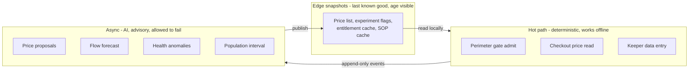

# Von Digitalis Estates | Architectural Katas 2026

> An architecture for the 72nd Countess Von Digitalis: sell tickets, learn what is popular, keep 200+ exotic animals healthy, and make a sprawling estate profitable - across patchy Wi-Fi, with AI that can prove it is working.

## Team

Team name: **SW People**

- Krzysztof Pytlik - [GitHub](https://github.com/pytlikk)
- Mohammed - [GitHub](https://github.com/mroj4n)
- Krzysiek Kopacz - [GitHub](https://github.com/Crafterro)

## Table of contents

- [The problem, in one paragraph](#the-problem-in-one-paragraph)
- [The architectural idea](#the-architectural-idea)
- [How AI solves the Countess's problems](#how-ai-solves-the-countesss-problems)
- [Repository structure](#repository-structure)
- [Problem statement](#problem-statement)
- [Capability map](#capability-map)
- [Tech stack at a glance](#tech-stack-at-a-glance)
- [Decision index](#decision-index)
- [How we verify the AI](#how-we-verify-the-ai)
- [What we deliberately did not do](#what-we-deliberately-did-not-do)
- [Phasing](#phasing)

## The problem, in one paragraph

The estate takes 5,000 visitors a day and must reach 15,000 within three years or the family sells the carnivorous plants. It has 40 historic amusement rides, 200+ exotic and poisonous animals across 55 displays including a jumping-piranha colony, no idea which parts of it are popular, no way to earn returning visitors, and Wi-Fi that does not reach the animal houses. There is budget for MQTT hardware and permission to use the cloud, provided data can actually get there.

## The architectural idea

Everything in this repository follows from one split.

> **Hot paths are deterministic and local. AI is asynchronous and advisory. A gap is unknown, never zero.**

The gate admits a guest by verifying a signature offline. Checkout reads a price from a published snapshot. A keeper records a feed in a building with no signal. None of those three things calls a model, and none of them calls the cloud.

The AI runs behind that line - on a schedule, reading the warehouse, writing to an alert inbox or a snapshot. Every capability has a named fallback that has actually run, and every capability can say *I don't know*: a silent zone renders as unknown rather than empty, a forecast suppresses itself when coverage drops, and the piranha population refuses to publish a number once its census anchor is too old.

The arrow that does not exist is the important one: nothing in `hot` ever calls `async`.

## How AI solves the Countess's problems

She asked four things. Each maps to one deep-dive, and each has a deliberate limit.

**"We have no real idea what parts of the estates are most popular."** MQTT zone counters, ride cycle counts, and gate scans fuse into a heat map where **every figure carries the coverage that produced it**. A dead sensor shows as unknown, because a hole rendered as a quiet zone would send staff away from the one place we cannot see. A 30-90 minute congestion forecast sits on top and suppresses itself when coverage drops, falling back to same-daypart-last-week. Staffing advice adds the number nobody had before: the yield at risk per hour when a *popular* ride is down. → [Popularity and flow](hld/scenarios/popularity-flow/README.md)

**"Looking after the animals is costly, even more so if they get sick."** There are no labels - nobody has ever recorded this collection's feeding in a structured way. So keeper-authored rules alert from day one and remain the permanent fallback, while the model scores in shadow and is promoted **per subject type** only where it beats those rules inside the keeper's attention budget. A fortnightly-feeding python and a daily-feeding colony are different problems. → [Animal care](hld/scenarios/animal-care/README.md)

**"In the case of the jumping piranha collection, we also need to check population levels."** You cannot count a dense shoal from outside - occlusion scales with the density you are measuring - and censusing means netting a tank of piranha, which is hazardous for keepers and stressful for the colony. So the estate publishes an **interval anchored on human census** that widens with time since the last anchor, tracks change from measured feed consumption between anchors, and decrements by exactly one when a keeper confirms a carcass. The system asks for a census when its own uncertainty demands one. → [ADR-0023](adrs/ADR-0023%20-%20Anchor%20aquatic%20population%20on%20human%20census.md)

**"We need to work out how to grow visitors and make the estate more profitable."** A scheduled job proposes prices, deterministic code clamps them inside commercial floors and ceilings, and the result is published as a versioned snapshot every channel reads locally. Experiments on family-pass composition are assigned once at purchase and carried inside the signed entitlement, so a variant is sticky across web, kiosk, and a disconnected gate. Cohort analysis then explains *who* responded - from declared party structure and consented attributes, never inferred demographics. → [Yield](hld/scenarios/yield/README.md)

## Repository structure

| Folder | Contents |
|:--|:--|
[`requirements/`](requirements/) | Business goals, challenges, FRs, NFRs, assumptions, risks, OKRs, appendices
[`adrs/`](adrs/) | Architecture decision records with trade-off analysis
[`hld/`](hld/README.md) | High level design - core platform, three AI deep-dives, MLOps, data structures
[`evals/`](evals/README.md) | Golden cases per AI capability (NFR_13)

## Problem statement

Greenfield. There is no legacy estate software; paper and spreadsheets are not systems of record.

- [Business goals and drivers](requirements/1_0_Business%20goals%20%26%20drivers.md) · [Suggested OKRs](requirements/suggested%20OKRs/OKRs.md)
- [Business challenges and pain points](requirements/1_1_Business%20challenges.md)
- [Functional requirements](requirements/2_FRs.md) · [Appendix A: core functionality](requirements/Appendix%20A_%20Core%20functionality.md) · [Appendix B: AI scenarios](requirements/Appendix%20B_%20AI%20scenarios%20explained.md)
- [Non-functional requirements](requirements/3_NFRs.md)
- [Assumptions and constraints](requirements/4_Assumptions%20and%20constraints.md)
- [Risks and mitigation](requirements/5_Risks%20and%20mitigation.md)
- [Appendix C: future scope](requirements/Appendix%20C_%20Future%20scope.md)

## Capability map

Capability → requirement → decision → design.

| Capability | FR | ADR | HLD |
|:--|:--|:--|:--|
| **Guest and commercial platform** | | | |
| Buy admission and family passes | [FR#1](requirements/2_FRs.md), [A 1-1](requirements/Appendix%20A_%20Core%20functionality.md) | [ADR-0001](adrs/ADR-0001%20-%20GCP%20as%20the%20estate%20cloud%20platform.md) | [Core platform](hld/core-func/README.md) |
| Entitlements and party rules | [A 1-2](requirements/Appendix%20A_%20Core%20functionality.md) | [ADR-0002](adrs/ADR-0002%20-%20Signed%20QR%20entitlement%20at%20the%20perimeter%20gate.md) | [Containers](hld/core-func/2_Containers.md) |
| Offline gate access | [A 1-3](requirements/Appendix%20A_%20Core%20functionality.md) | [ADR-0002](adrs/ADR-0002%20-%20Signed%20QR%20entitlement%20at%20the%20perimeter%20gate.md) | [Gate sequence](hld/core-func/3_Gate_Redeem_Sequence.md) |
| Optional identity and membership | [A 1-4](requirements/Appendix%20A_%20Core%20functionality.md) | [ADR-0012](adrs/ADR-0012%20-%20Cohort%20analysis%20on%20declared%20attributes%20only.md) | [Context](hld/core-func/1_Context.md) |
| Price list and experiment snapshots | [A 3-1](requirements/Appendix%20A_%20Core%20functionality.md) | [ADR-0010](adrs/ADR-0010%20-%20Publish%20prices%20asynchronously%20inside%20approved%20bands.md) | [Yield](hld/scenarios/yield/README.md) |
| **Platform foundations** | | | |
| Estate-to-cloud telemetry | [FR#1](requirements/2_FRs.md), NFR_5 | [ADR-0003](adrs/ADR-0003%20-%20MQTT%20gateways%20as%20the%20estate-to-cloud%20path.md) | [Containers](hld/core-func/2_Containers.md) |
| Ops intranet | [A 2-1..2-7](requirements/Appendix%20A_%20Core%20functionality.md) | [ADR-0005](adrs/ADR-0005%20-%20Human-in-the-loop%20authority%20for%20estate%20AI.md) | [Maintenance and intranet](hld/core-func/4_Maintenance_and_Intranet.md) |
| Model portability and fallbacks | [FR#3](requirements/2_FRs.md), NFR_14 | [ADR-0004](adrs/ADR-0004%20-%20Vertex%20AI%20behind%20a%20capability%20interface.md) | [MLOps](hld/mlops/README.md) |
| **AI: yield and growth** | | | |
| Async dynamic pricing | [FR#2A](requirements/2_FRs.md) | [ADR-0010](adrs/ADR-0010%20-%20Publish%20prices%20asynchronously%20inside%20approved%20bands.md) | [Yield](hld/scenarios/yield/README.md) |
| Offline A/B experiments | [FR#2B](requirements/2_FRs.md) | [ADR-0011](adrs/ADR-0011%20-%20Sticky%20offline%20experiment%20assignment.md) | [Yield](hld/scenarios/yield/README.md) |
| Cohort and demographic analysis | [FR#2C](requirements/2_FRs.md) | [ADR-0012](adrs/ADR-0012%20-%20Cohort%20analysis%20on%20declared%20attributes%20only.md) | [Yield](hld/scenarios/yield/README.md) |
| Win-back and next-best-visit | [FR#2H](requirements/2_FRs.md) | [ADR-0012](adrs/ADR-0012%20-%20Cohort%20analysis%20on%20declared%20attributes%20only.md) | [Yield](hld/scenarios/yield/README.md) |
| **AI: popularity and flow** | | | |
| Popularity and dwell | [FR#2D](requirements/2_FRs.md) | [ADR-0013](adrs/ADR-0013%20-%20Popularity%20and%20flow%20as%20advisory%20signals%20that%20degrade%20to%20unknown.md) | [Popularity and flow](hld/scenarios/popularity-flow/README.md) |
| Congestion forecast | [FR#2E](requirements/2_FRs.md) | [ADR-0013](adrs/ADR-0013%20-%20Popularity%20and%20flow%20as%20advisory%20signals%20that%20degrade%20to%20unknown.md) | [Popularity and flow](hld/scenarios/popularity-flow/README.md) |
| Staffing and investment advice | [FR#2F](requirements/2_FRs.md) | [ADR-0013](adrs/ADR-0013%20-%20Popularity%20and%20flow%20as%20advisory%20signals%20that%20degrade%20to%20unknown.md) | [Popularity and flow](hld/scenarios/popularity-flow/README.md) |
| Guest itinerary suggestions | [FR#2G](requirements/2_FRs.md) | [ADR-0013](adrs/ADR-0013%20-%20Popularity%20and%20flow%20as%20advisory%20signals%20that%20degrade%20to%20unknown.md) | [Popularity and flow](hld/scenarios/popularity-flow/README.md) |
| **AI: animal welfare** | | | |
| Care subject model | [FR#2I](requirements/2_FRs.md), [A 2-4](requirements/Appendix%20A_%20Core%20functionality.md) | [ADR-0020](adrs/ADR-0020%20-%20Enclosure%20and%20colony%20as%20the%20care%20subject.md) | [Animal care](hld/scenarios/animal-care/README.md) |
| Offline keeper capture | [FR#2I](requirements/2_FRs.md), NFR_17 | [ADR-0021](adrs/ADR-0021%20-%20Keeper%20field%20events%20are%20append-only%20and%20offline-first.md) | [Animal care](hld/scenarios/animal-care/README.md) |
| Health and feeding anomalies | [FR#2I](requirements/2_FRs.md) | [ADR-0022](adrs/ADR-0022%20-%20Shadow%20before%20promote%20for%20animal%20health%20anomaly%20detection.md) | [Animal care](hld/scenarios/animal-care/README.md) |
| Aquatic population tracking | [FR#2J](requirements/2_FRs.md) | [ADR-0023](adrs/ADR-0023%20-%20Anchor%20aquatic%20population%20on%20human%20census.md) | [Animal care](hld/scenarios/animal-care/README.md) |
| **AI: ride maintenance** | | | |
| Predictive ride maintenance | [FR#2K](requirements/2_FRs.md) | [ADR-0005](adrs/ADR-0005%20-%20Human-in-the-loop%20authority%20for%20estate%20AI.md) | [Maintenance and intranet](hld/core-func/4_Maintenance_and_Intranet.md) |

## Tech stack at a glance

**On estate - must work offline**
- Gate lane devices: local signature verification plus a party ledger; no network on the admit path
- Zone gateways: MQTT broker with disk-backed store-and-forward; the unit of islanding
- Keeper handhelds: append-only offline capture, gloved use, full-shift battery
- Edge snapshot store: price list, experiment flags, revocation list, SOP cache - each with its age visible

**Cloud core (GCP)**
- Pub/Sub as the event backbone, sized for reconnect backfill rather than steady state
- Dataflow for validation, dedupe, and **gap detection** - where `unknown` is created
- Cloud Run for ticketing, entitlement minting, and the intranet BFF
- BigQuery as the warehouse, tiered hot 30d / warm 1y / cold 3y

**AI**
- Vertex AI for training, batch scoring, and evaluation
- Every capability behind an estate-owned typed interface with a **named, exercised fallback**
- Pinned versions, metered cost, and a kill switch per capability

**Deliberately not in the stack:** a managed model control plane (answering vendor risk by adding a vendor), always-on inference serving (all three deep-dives are scheduled jobs), computer vision for people (privacy and cost), and a guest mobile app as a requirement (web and kiosk work when signal does not).

## Decision index

| ADR | Decision |
|:--|:--|
[ADR-0000](adrs/ADR-0000%20-%20Template.md) | Template
[ADR-0001](adrs/ADR-0001%20-%20GCP%20as%20the%20estate%20cloud%20platform.md) | GCP for ingest, warehouse, and async AI - with the estate operable without it
[ADR-0002](adrs/ADR-0002%20-%20Signed%20QR%20entitlement%20at%20the%20perimeter%20gate.md) | Admit on a server-signed entitlement verified locally at the perimeter
[ADR-0003](adrs/ADR-0003%20-%20MQTT%20gateways%20as%20the%20estate-to-cloud%20path.md) | Zone MQTT gateways with store-and-forward; a gap is published as unknown
[ADR-0004](adrs/ADR-0004%20-%20Vertex%20AI%20behind%20a%20capability%20interface.md) | Every AI capability behind an estate-owned interface with a named fallback
[ADR-0005](adrs/ADR-0005%20-%20Human-in-the-loop%20authority%20for%20estate%20AI.md) | Authority assigned per capability; no model holds authority over safety or welfare
[ADR-0010](adrs/ADR-0010%20-%20Publish%20prices%20asynchronously%20inside%20approved%20bands.md) | Prices published as a snapshot inside human-approved bands
[ADR-0011](adrs/ADR-0011%20-%20Sticky%20offline%20experiment%20assignment.md) | Variant assigned at purchase and carried in the entitlement
[ADR-0012](adrs/ADR-0012%20-%20Cohort%20analysis%20on%20declared%20attributes%20only.md) | Cohorts from declared and consented attributes; inferred never becomes a record
[ADR-0013](adrs/ADR-0013%20-%20Popularity%20and%20flow%20as%20advisory%20signals%20that%20degrade%20to%20unknown.md) | Popularity reported with coverage; the forecast stops when coverage drops
[ADR-0020](adrs/ADR-0020%20-%20Enclosure%20and%20colony%20as%20the%20care%20subject.md) | The care subject is the enclosure or colony; cardinality carries its certainty
[ADR-0021](adrs/ADR-0021%20-%20Keeper%20field%20events%20are%20append-only%20and%20offline-first.md) | Keeper entries are append-only; a confirmed fact is never revised by a model
[ADR-0022](adrs/ADR-0022%20-%20Shadow%20before%20promote%20for%20animal%20health%20anomaly%20detection.md) | Rules first, model in shadow, promotion earned per subject type
[ADR-0023](adrs/ADR-0023%20-%20Anchor%20aquatic%20population%20on%20human%20census.md) | Publish a population interval anchored on census, never a count

## How we verify the AI

Judges asked for validation and verification, and for dealing with uncertainty. [`evals/`](evals/README.md) holds golden cases per capability and [MLOps](hld/mlops/README.md) holds the promotion pipeline. Two kinds of case, and the second is what makes this checkable:

**Accuracy cases** - forecast error against a recency baseline, recall against keeper labels, interval coverage against census.

**Refusal cases** - a population estimate without an interval is rejected. A forecast on low coverage is suppressed. A shadow model produces no alert. A price above the ceiling is clamped. An inferred attribute cannot be written to a guest record.

An accuracy number is a claim that degrades quietly. A refusal case fails loudly the moment someone removes the guard.

On uncertainty: versions are pinned, model version is recorded on every output, fallbacks are exercised rather than documented, and an annual **swap drill** proves the two-week provider migration in NFR_14 by doing it.

## What we deliberately did not do

Stated because the omissions are decisions, each argued in the linked record.

| Not done | Why |
|:--|:--|
| Real-time or per-guest pricing | The purchase path must work offline ([ADR-0010](adrs/ADR-0010%20-%20Publish%20prices%20asynchronously%20inside%20approved%20bands.md)) |
| Per-attraction paid gating of 40 rides and 55 displays | Perimeter admission in v1; inside the estate we count, not gate ([ADR-0002](adrs/ADR-0002%20-%20Signed%20QR%20entitlement%20at%20the%20perimeter%20gate.md)) |
| Computer vision people counting | Privacy and cost; counts answer the question ([ADR-0013](adrs/ADR-0013%20-%20Popularity%20and%20flow%20as%20advisory%20signals%20that%20degrade%20to%20unknown.md)) |
| Inferred demographics | Fails the privacy bar, and declared party structure is the better signal ([ADR-0012](adrs/ADR-0012%20-%20Cohort%20analysis%20on%20declared%20attributes%20only.md)) |
| A conversational guest companion | A guest app that needs signal does not work here; itinerary cards degrade to print |
| Autonomous welfare or ride decisions | Capped by policy at Advise; no confidence buys this ([ADR-0005](adrs/ADR-0005%20-%20Human-in-the-loop%20authority%20for%20estate%20AI.md)) |
| Individual identification of fish | Occlusion is not an engineering problem here ([ADR-0023](adrs/ADR-0023%20-%20Anchor%20aquatic%20population%20on%20human%20census.md)) |

Deferred ideas are listed in [Appendix C](requirements/Appendix%20C_%20Future%20scope.md).

## Phasing

Four of six AI capabilities launch with **no history at all** - no conversion data, no occupancy history, no animal health labels, no fish counts. So each ships its pipeline with a human or a rule where the model will later sit, and phase 1 manufactures the training data phase 2 needs.

| Phase | Emphasis |
|:--|:--|
| 1 | Ticketing and offline gates, MQTT ingest, intranet heat map, animal and feed logs, experiment snapshots with **manually set prices** |
| 2 | Shadow AI: flow forecast, health anomalies, piranha interval; A/B on family-pass shapes |
| 3 | Cohort analysis, win-back, staffing advice, predictive maintenance on instrumented rides |
| Later | [Appendix C](requirements/Appendix%20C_%20Future%20scope.md) |

## Risks and future scope

- [Risks and mitigation](requirements/5_Risks%20and%20mitigation.md) - consolidated registry; per-decision trade-offs live in each ADR
- [Appendix C: future scope](requirements/Appendix%20C_%20Future%20scope.md)

## References

- [Google Cloud](https://cloud.google.com/) · [Vertex AI](https://cloud.google.com/vertex-ai) · [Pub/Sub](https://cloud.google.com/pubsub) · [BigQuery](https://cloud.google.com/bigquery)
- [MQTT (OASIS Standard v5.0)](https://docs.oasis-open.org/mqtt/mqtt/v5.0/mqtt-v5.0.html)
- [C4 model](https://c4model.com/) for the diagram conventions in [`hld/`](hld/README.md)

---

> Note: Portions of this repository were developed using AI-assisted tools under human supervision. All final content was reviewed and approved by the authors, who take full responsibility for it.
