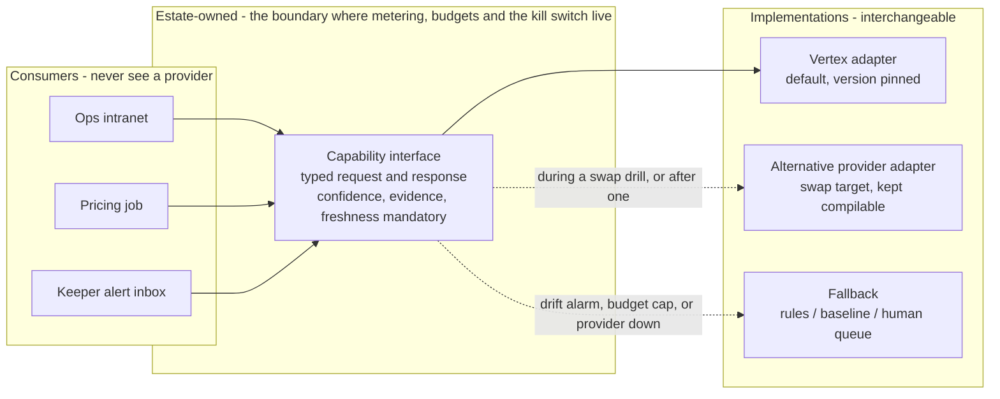

# ADR-0004 - Every AI capability sits behind an estate-owned interface with a named non-AI fallback

## Date

2026-09-14

## Status

Proposed

## Context

The judges named this one directly: *dealing with uncertainty in the world of AI technology*. NFR_14 turns it into a requirement - assume today's best model may be worse, more expensive, or gone, and be able to swap a provider for a given capability in **under two weeks** without changing ticketing or MQTT contracts.

The estate has **seven** AI capabilities worth building (FR#2, [Appendix B](../requirements/Appendix%20B_%20AI%20scenarios%20explained.md)); the [canonical inventory](#the-canonical-inventory) is in the decision below. Their technical profiles differ enormously. A flow forecast is a small time-series model on our own telemetry. A copilot is a third-party foundation model we will never own. Treating them identically would either over-engineer the forecast or under-protect the copilot.

The real exposure is not "which model is best today". It is that a capability grows tendrils: a Vertex-specific response shape leaks into the intranet, a prompt ends up in a service, and two years later the swap is a rewrite. Last year's winning repo leaned on a vendor control plane for this; a managed SaaS control plane is itself a vendor dependency, and adding one to solve vendor risk is circular for a three-person team.

This record decides how models are integrated and replaced. It does not decide which model each capability uses - those belong in the capability ADRs - nor how humans review output ([ADR-0005](ADR-0005%20-%20Human-in-the-loop%20authority%20for%20estate%20AI.md)).

**Foreclosed here:** any capability whose output flows into the estate without passing through an estate-owned interface, and any capability shipped without a named non-AI fallback.

## Evaluation criteria

- **Two-week swap for one capability (driving)** - NFR_14's target, measured by an actual drill rather than by assertion.
- **Fallback exists and has been exercised (driving)** - every capability must have a rules, baseline, or human path that has actually run in production, not one that exists on paper.
- **Cost containment (NFR_12)** - inference must be visible per capability and killable without taking the estate down.
- **Operability for a three-person team** - the abstraction must be cheaper than the lock-in it prevents.
- **Safety pinning (NFR_7)** - no silent model upgrade on a path adjacent to welfare or ride safety.

## Options

- **Option A - Call provider SDKs directly from each service**: simplest, fastest to build.
- **Option B - Managed SaaS model control plane**: buy routing, governance, and cost control as a product.
- **Option C - Estate-owned capability interfaces with Vertex AI as the default implementation (chosen)**: each capability is a named internal contract; the model lives behind it; Vertex is today's answer.
- **Option D - Full self-hosted model serving**: own the whole stack, no provider dependency.

| | Two-week swap (driving) | Fallback exercised (driving) | Cost containment | Operability | Safety pinning |
|---|---|---|---|---|---|
| A Direct SDK | Fail - provider shapes leak into consumers; swap is a rewrite | Fail - nothing forces a fallback to exist | Partial | Pass - least code | Partial |
| B SaaS control plane | Pass - routing is the product | Partial - provided if configured | Pass | Partial - a new vendor, new bill, new outage mode | Partial - depends on the vendor |
| C Estate interfaces | Pass - one adapter per capability | Pass - the interface makes the fallback a required implementation | Pass - metering at the boundary | Pass - a thin layer we own | Pass - we pin |
| D Self-hosted | Pass - no provider at all | Pass | Partial - capex and idle GPU | Fail - three people cannot run serving infrastructure | Pass |

Not options: a model gateway product bought before a single capability is in production (solving a scaling problem we do not have); per-capability bespoke integration patterns (the inconsistency is the lock-in).

## Decision

**Each AI capability is an estate-owned interface with three required parts: a typed contract, a provider adapter, and a fallback implementation. Vertex AI is the default adapter. No consumer ever sees a provider type.**

A capability that cannot name its fallback is not ready to ship.

Four rules follow.

**The contract carries confidence, evidence, and freshness - never a bare answer.** Every response says how sure it is, what it looked at, and how old that input was. This is what makes [ADR-0005](ADR-0005%20-%20Human-in-the-loop%20authority%20for%20estate%20AI.md) enforceable and what lets a consumer degrade instead of guess.

**The fallback is named per capability and is exercised in production, not documented.** A fallback that has never run is a hypothesis.

| Capability | Model today | Fallback when the model is unavailable or untrusted |
|---|---|---|
| Price proposal ([ADR-0010](ADR-0010%20-%20Publish%20prices%20asynchronously%20inside%20approved%20bands.md)) | ML on conversion history | Last published price list, then the commercially approved default band |
| Cohort analysis ([ADR-0012](ADR-0012%20-%20Cohort%20analysis%20on%20declared%20attributes%20only.md)) | Clustering plus GenAI narrative | Declared-attribute pivot tables; no narrative |
| Flow forecast ([ADR-0013](ADR-0013%20-%20Popularity%20and%20flow%20as%20advisory%20signals%20that%20degrade%20to%20unknown.md)) | Time-series model | Same daypart last week, same weather class |
| Animal health anomaly ([ADR-0022](ADR-0022%20-%20Shadow%20before%20promote%20for%20animal%20health%20anomaly%20detection.md)) | Anomaly scoring | Deterministic threshold rules keepers already trust |
| Piranha population ([ADR-0023](ADR-0023%20-%20Anchor%20aquatic%20population%20on%20human%20census.md)) | Feed-derived estimate | Last census anchor, published as unusable past maximum age |
| Ride maintenance ([ADR-0014](ADR-0014%20-%20Predictive%20ride%20maintenance%20in%20shadow%20behind%20the%20inspection%20schedule.md)) | Anomaly on vibration and usage | The statutory inspection schedule, which runs regardless |
| Ops copilot (optional) | Grounded RAG | Search over the same documents, no generation |

### The canonical inventory

Seven capabilities. **This table is the authority**; anything counted differently elsewhere is a defect in that document, not a real disagreement.

| # | Capability | ADR | Model class | Authority ceiling | Budget |
|--:|:--|:--|:--|:--|--:|
| 1 | Price proposal | [ADR-0010](ADR-0010%20-%20Publish%20prices%20asynchronously%20inside%20approved%20bands.md) | BigQuery ML | L3 in band | $15 |
| 2 | Cohort analysis | [ADR-0012](ADR-0012%20-%20Cohort%20analysis%20on%20declared%20attributes%20only.md) | BigQuery ML clustering **+ a GenAI prose layer** | L1 | $10 |
| 3 | Flow forecast | [ADR-0013](ADR-0013%20-%20Popularity%20and%20flow%20as%20advisory%20signals%20that%20degrade%20to%20unknown.md) | BigQuery ML ARIMA | L1 | $20 |
| 4 | Animal health anomaly | [ADR-0022](ADR-0022%20-%20Shadow%20before%20promote%20for%20animal%20health%20anomaly%20detection.md) | BigQuery ML | L2 max | $50 |
| 5 | Piranha population | [ADR-0023](ADR-0023%20-%20Anchor%20aquatic%20population%20on%20human%20census.md) | BigQuery ML | L1 max | $10 |
| 6 | Ride maintenance | [ADR-0014](ADR-0014%20-%20Predictive%20ride%20maintenance%20in%20shadow%20behind%20the%20inspection%20schedule.md) | BigQuery ML | L2 max | $75 |
| 7 | Ops copilot | *none, deliberately* | Foundation model, retrieval | L1 | $30 |

Six of the seven are classical models trained in BigQuery ML on estate-owned tables. **Only two paths send text to a language model**: the prose layer on capability 2, and capability 7. That is the fact [uncertainty](../hld/mlops/uncertainty.md) and [llm-security](../hld/mlops/llm-security.md) both turn on, and the reason the copilot is the only capability without an ADR - it is optional, display-only, and adds no architectural constraint the others do not already carry.

[ADR-0005](ADR-0005%20-%20Human-in-the-loop%20authority%20for%20estate%20AI.md) governs eleven rows rather than seven, and the extra four are not missing capabilities:

| Row in ADR-0005 | What it actually is |
|:--|:--|
| Staffing recommendation | A surface of capability 3 |
| Guest itinerary suggestion | A surface of capability 3 |
| Win-back offer | A surface of capability 2 |
| Experiment assignment | **Not AI.** A hash and a denylist, both deterministic code ([ADR-0011](ADR-0011%20-%20Sticky%20offline%20experiment%20assignment.md)) |

A surface consumes a capability's output; it does not have its own model, budget, or eval set. Governing it in ADR-0005 anyway is deliberate - **the thing a human sees is what needs an authority level**, and an itinerary card is a place a forecast can do harm even though it is not itself a capability.

**Versions are pinned, and safety-adjacent capabilities never auto-upgrade.** Animal health and anything touching ride status are pinned explicitly; a version change is a promotion event with evals, not a provider release note. Model version is recorded on every output so any decision can be traced to the thing that produced it.

**Metering happens at the interface.** Inference calls and cost are attributed per capability at the boundary, and each capability has a budget with a kill switch that drops it to its fallback rather than taking the consumer down.

The swap target and the fallback requirement decided it. Direct SDK calls (A) fail both - they leak provider shapes and never force a fallback to exist. A SaaS control plane (B) genuinely delivers routing, and it loses because it answers vendor risk by adding a vendor, with its own bill and its own outage mode, for a team that cannot absorb another dependency. Self-hosting (D) is the only option with no provider exposure and it is not operable at three people.

## Key differentiators

- **The swap is one adapter, and the drill proves it.** NFR_14 becomes a rehearsed operation rather than a claim in a document.
- **Every capability has somewhere to fall back to,** so a provider outage degrades the estate instead of stopping it.
- **Confidence, evidence, and freshness are structural,** which is what lets human-in-the-loop and gap-as-unknown be enforced rather than hoped for.
- **The abstraction is thin and ours.** No control-plane vendor sits between the estate and its own models.
- **Cost is attributable and killable per capability,** so the vision or GenAI line can be switched off without switching off the intranet.

## Architecture characteristics

| Characteristic | Effect | Why |
|---|---|---|
| Portability | **Improved (driving)** | One adapter per capability; consumers never hold a provider type (NFR_14). |
| Fault tolerance | **Improved (driving)** | A named, exercised fallback per capability means provider failure is a degradation, not an outage. |
| Testability | **Improved** | A typed contract can be stubbed, so golden cases run with no provider at all (NFR_13). |
| Auditability | **Improved** | Model version, confidence, and evidence recorded on every output (NFR_7). |
| Cost control | **Improved** | Metering and kill switch at the boundary (NFR_12). |
| Development speed | **Weakened (deliberate)** | Two implementations per capability before anything ships, and provider features that do not fit the contract are unavailable. |
| Capability ceiling | **Weakened** | The interface is the lowest common denominator; a genuinely better provider-specific feature needs a contract change to reach a consumer. |

**Deliberately downplayed: time to first working model.** Requiring a fallback and a typed contract before shipping is slower than calling an SDK, and for a three-person team that is a real cost. It is spent because the kata's stated uncertainty is precisely about providers, and because every one of these capabilities touches either money or an animal - so "the model is down" needs an answer that is not "the estate stops".

**Fit with the existing architecture.** Same shape as the rest of the estate: a well-defined local contract, a remote dependency that is allowed to fail, and a degraded mode that is explicit rather than silent. The gate falls back to a local ledger, a zone falls back to unknown, and a capability falls back to rules or last week's baseline. AI is not a sidecar here - it is another replaceable implementation behind an estate contract, which is the NFR_15 bar.

## Consequences

### Positive

- A provider swap is a scoped, rehearsed change (driving criterion).
- Every capability degrades to something the estate already trusts (driving criterion).
- Golden cases run in CI without calling a provider.
- Inference cost is attributable per capability and killable independently.

### Negative

- **Two implementations per capability, forever.** The fallback is real code with real maintenance, and it is exercised rarely enough to rot unless deliberately run.
- **The contract is a ceiling.** When a provider ships something genuinely better that does not fit, the choice is a contract change or forgoing it - and that friction will occasionally be the wrong answer.
- A thin abstraction invites leaks: one provider-specific field in a response and the swap target quietly expires. Only tests prevent this.
- Fallback quality is visibly worse. Staff will notice when the forecast becomes "last week, same daypart", and that transition needs to be labelled in the UI or it reads as the system being wrong.

## Risks & trade-offs

| Risk area | Description | Mitigation |
|---|---|---|
| Abstraction leak | Provider fields reach consumers, killing the swap target | Contract types own the response shape; CI forbids provider SDK imports outside adapters; the swap drill is the real detector |
| Fallback rot | The fallback path breaks unnoticed | Scheduled fallback exercise per capability; the drill runs it in production for a defined window |
| Silent model change | Provider updates behaviour under us | Pinned versions; version recorded per output; drift alarms on golden cases (NFR_13) |
| Cost shock | Repricing or a runaway job | Per-capability budget and kill switch to fallback; alerting before the ceiling |
| Over-abstraction | The layer costs more than the lock-in it prevents | Interface is per capability, not a framework; no routing, caching, or policy engine until a second provider actually exists |
| Provider shutdown | The default adapter disappears | Two-week swap drill per year on a designated capability; at least one alternative adapter kept compilable. Named: **Anthropic Claude via Vertex AI Model Garden** if the model goes, **Mistral Small self-hosted on Cloud Run with an L4 GPU** if the provider goes. Six of seven capabilities are BigQuery ML and survive either without change. See [uncertainty](../hld/mlops/uncertainty.md#what-might-happen-if-the-provider-you-used-suddenly-shut-down). |
| Uniformity pressure | Forcing a copilot and a time-series forecast into one shape | Contract is per capability; only confidence, evidence, and freshness are universal |

## Verification

**Primary metrics**

- **Swap drill duration** for a designated capability, against the two-week target (OKR 7.2).
- Share of live AI capabilities with golden cases and a drift alarm - target 100% (OKR 7.1).
- Inference cost per capability per period, against its budget.
- Fallback exercise recency per capability.

**Tests (CI)**

- No provider SDK import outside an adapter module.
- Every capability has a fallback implementation registered; a capability without one fails the build.
- Golden cases run against a stubbed contract with no provider credentials present.
- A forced adapter failure routes to the fallback and the consumer still returns a typed response with degraded freshness.
- Every response carries model version, confidence, and freshness; a response missing any of them is rejected.
- A safety-adjacent capability rejects an unpinned model version.

**Ops check**

- Annual swap drill on a real capability, timed and written up.
- Kill switch exercised per capability in staging, confirming the consumer degrades rather than errors.

**Open questions**

- Which capability is the designated swap-drill subject - before the first capability leaves shadow. The flow forecast is the natural candidate, being ours and least safety-adjacent.
- ~~Per-capability inference budgets - with commercial, before go-live.~~ **Resolved** in [cost-analysis](../cost-analysis/README.md#7-per-capability-inference-budgets): seven budgets with an alert threshold at ~3x modelled spend and a hard cap at ~10x, each cap naming the fallback the capability serves instead. Total modelled inference is $17.08/month against a $210 combined cap.
- ~~Whether the ops copilot is funded at all, given it is the only capability whose cost scales with staff curiosity rather than with estate size.~~ **Resolved: yes, with a $30 cap.** At the modelled 1,800 queries/month it costs $2.61, which is 3.6% of the cloud bill. The cap drops it to non-generative SOP retrieval rather than switching it off, because the risk is the usage multiplier and not the rate - at 100x the assumed usage it would cost more than the rest of the platform combined. Arithmetic in [cost-analysis](../cost-analysis/README.md#is-the-ops-copilot-funded).
- How fallback mode is signalled in the intranet UI - with the intranet workstream, before the first promotion.

**Revisit triggers**

- A swap drill exceeds two weeks - the abstraction is not doing its job; fix it before adding capabilities.
- A second provider is genuinely in production for the same capability - then routing and A/B between providers becomes worth building, and a control plane can be re-evaluated on evidence.
- A provider's pricing model changes such that batch scoring is no longer the cheap path - revisit the async assumption in [ADR-0010](ADR-0010%20-%20Publish%20prices%20asynchronously%20inside%20approved%20bands.md) and [ADR-0013](ADR-0013%20-%20Popularity%20and%20flow%20as%20advisory%20signals%20that%20degrade%20to%20unknown.md).

## Conclusion

Every AI capability is an estate-owned interface with a typed contract, a Vertex adapter, and a named fallback that is actually exercised; confidence, evidence, and freshness are mandatory on every response. This is chosen on the two-week swap target and on the requirement that no capability can fail the estate closed. The cost is a second implementation per capability and a contract that occasionally denies us a provider's best new feature - accepted because the kata's named uncertainty is exactly this, and because every capability here touches money or an animal.

Related: [ADR-0001](ADR-0001%20-%20GCP%20as%20the%20estate%20cloud%20platform.md) (Vertex as the default home), [ADR-0005](ADR-0005%20-%20Human-in-the-loop%20authority%20for%20estate%20AI.md) (who acts on these outputs), [`evals/`](../evals/) (the golden cases every capability must pass), [hld/mlops](../hld/mlops/README.md) (the promotion pipeline).
