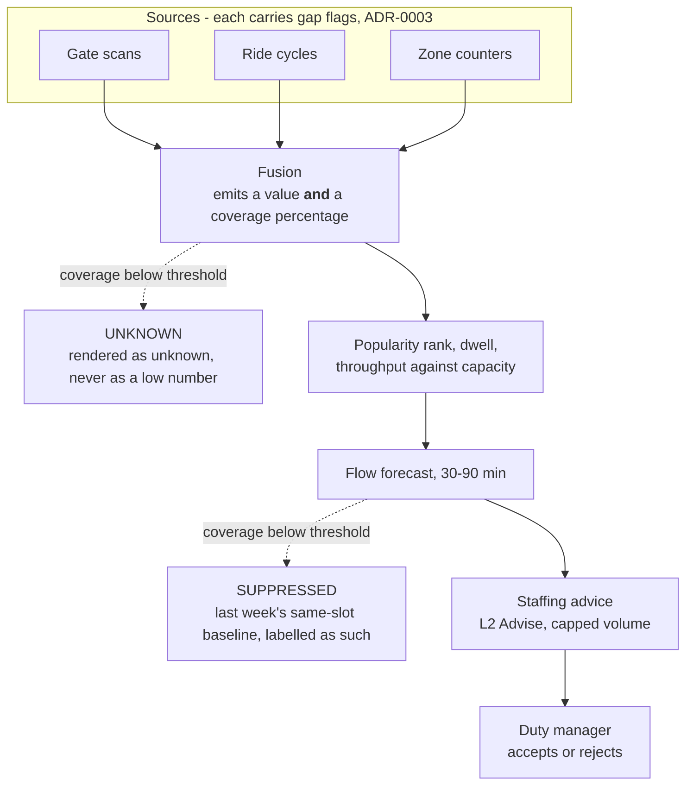

# ADR-0013 - Popularity is reported with its coverage, and the forecast stops when coverage drops

## Date

2026-09-14

## Status

Proposed

## Context

This is the estate's loudest problem. The Countess has "no real idea what parts of the estates are most popular, so it's difficult to know where to invest & deploy staff" - stated twice in the brief, as a business challenge and as a goal.

The data will come from gate scans, ride cycle counts, and MQTT zone counters across 40 rides and 55 displays. The temptation is to render that as a heat map and move on.

The reason that fails is the estate itself. Wi-Fi is patchy, gateways island, and sensors on 18th-century rides will break. So the heat map will routinely have holes - and a hole rendered as a cool zone is worse than no heat map at all, because it produces a confident, wrong instruction: *send nobody to zone C*. The duty manager moves staff away from the one place the estate cannot currently see. A blank heat map is useless; a wrong heat map is actively harmful, and it will not announce itself.

The same trap sits under the forecast. A congestion model fed partial occupancy will predict a quiet afternoon in a zone whose counter died at 11am, and the prediction will look exactly as confident as a good one.

There is also a cold-start reality: no historical occupancy exists. Nobody has ever measured this estate. A forecast has nothing to learn from on day one, so the capability must be honest about starting as a baseline.

This record decides how popularity is computed and published, how the forecast behaves when inputs degrade, and how staffing advice is bounded. It does not decide sensor procurement or zone boundaries ([ADR-0003](ADR-0003%20-%20MQTT%20gateways%20as%20the%20estate-to-cloud%20path.md) open questions).

**Foreclosed here:** publishing an occupancy or popularity figure without its coverage, and interpolating across a known gap.

## Evaluation criteria

- **A gap is never rendered as a low number (driving)** - the failure that sends staff the wrong way. Absence must be visually and numerically distinct from emptiness.
- **The forecast knows when to stop talking (driving)** - below a coverage threshold it must withhold rather than predict, because a confident wrong forecast costs more than no forecast.
- **Useful on day one with no history** - phase 1 has counts and no model ([Appendix C](../requirements/Appendix%20C_%20Future%20scope.md)).
- **Beats a trivial baseline** - "same daypart last week" is the bar; a model that cannot beat it is not worth its cost or its risk.
- **Staffing advice is workable** - the duty manager's attention is budgeted ([ADR-0005](ADR-0005%20-%20Human-in-the-loop%20authority%20for%20estate%20AI.md)).

## Options

- **Option A - Best-effort fusion**: combine whatever data arrived, interpolate gaps, publish a complete-looking map.
- **Option B - Raw counts only**: display per-sensor counts, no fusion, no forecast.
- **Option C - Coverage-qualified fusion with a gated forecast (chosen)**: every figure carries the share of expected sources that reported; gaps render as unknown; the forecast is suppressed below a coverage threshold and falls back to a recency baseline.
- **Option D - Camera-based people counting**: computer vision across the estate for complete coverage.

| | Gap never a low number (driving) | Forecast stops appropriately (driving) | Cold start | Beats baseline | Usability |
|---|---|---|---|---|---|
| A Best-effort fusion | Fail - interpolation is exactly the harmful failure | Fail - no notion of its own blindness | Pass | Partial | Pass - looks best, is worst |
| B Raw counts | Pass - nothing is claimed | n/a - no forecast | Pass | Fail | Fail - 95 numbers is not an answer to "where do I send staff" |
| C Coverage-qualified | Pass - coverage published with every figure | Pass - threshold-gated, baseline fallback | Pass - counts work with no model | Pass - measured against recency | Partial - unknown patches invite questions |
| D Vision counting | Partial - cameras fail too, and occlusion bias is invisible | Partial | Fail - needs labels | Pass | Pass |

Not options: full computer-vision people tracking across 55 exhibits (deferred in [Appendix C](../requirements/Appendix%20C_%20Future%20scope.md) on privacy and cost; NFR_8 prefers counts over identification); individual guest trails without consent.

## Decision

**Every popularity and occupancy figure is published with the coverage that produced it. Gaps are unknown. The forecast is suppressed when coverage falls below a threshold, and falls back to a recency baseline.**

Four rules follow.

**Coverage travels with every number, all the way to the screen.** A zone at "1,200 guests, 40% coverage" is a different statement from "1,200 guests, 100% coverage", and the duty manager must see which one they are looking at. A heat map cell with insufficient coverage renders as a distinct unknown state - not pale, not zero, not absent.

**The forecast withholds rather than degrades quietly.** Below the coverage threshold it publishes no prediction and shows the recency baseline instead, labelled as such. This is the same posture as [ADR-0023](ADR-0023%20-%20Anchor%20aquatic%20population%20on%20human%20census.md) refusing to publish a population past its anchor age: the capability's willingness to say nothing is what makes its output trustworthy when it does speak.

**Staffing advice joins popularity to money, and is capped.** The useful sentence is not "zone C is busy" but "zone C is busy, ride 12 there is in the top popularity quartile and currently down, and that is roughly X in admission-attributable yield per hour". Advice volume is capped per shift; over the cap, the capability raises its threshold rather than asking for more of the duty manager's day.

**Popularity ranking needs a minimum observation window before it is used for investment.** A ride that looks unpopular for a week may have been raining on, or closed, or measured by a dying sensor. Investment-grade rankings state their window and their coverage over that window. The Countess deciding which enclosure to refurbish is the highest-stakes use of this data and the one most likely to be made on too little of it.

Authority: popularity and forecast are **L1 Inform**, staffing advice is **L2 Advise** ([ADR-0005](ADR-0005%20-%20Human-in-the-loop%20authority%20for%20estate%20AI.md)).

Gap honesty and forecast gating decided it. Best-effort fusion (A) is the option a demo would choose and the one that misdirects staff on the estate's worst days - and it is worth being explicit that the most attractive-looking dashboard is the dangerous one here. Raw counts (B) are honest and unusable: 95 numbers do not answer "where do I send three hosts". Vision (D) fails cold start, costs the most, and carries an occlusion bias that is invisible in exactly the crowded conditions we most want to measure.

## Key differentiators

- **The map tells you where it cannot see,** which is the difference between a tool and a liability on a patchy-Wi-Fi estate.
- **The forecast has a defined silence,** so staff learn that a prediction being shown means something.
- **Advice carries yield-at-risk,** joining popularity, downtime, and revenue for the first time - the specific gap named in [1_1 Business challenges](../requirements/1_1_Business%20challenges.md).
- **Phase 1 is useful with zero models,** because counts plus coverage already answer the Countess's question.
- **The baseline is a first-class fallback,** not an error state - so degradation is a labelled mode rather than an outage.

## Architecture characteristics

| Characteristic | Effect | Why |
|---|---|---|
| Data integrity | **Improved (driving)** | No figure is published without the coverage that produced it; no interpolation across gaps. |
| Trustworthiness | **Improved (driving)** | The capability's silence is meaningful, so its output is actionable. |
| Observability | **Improved** | Coverage is both a data-quality metric and an operational signal about which sensors are dead (NFR_11). |
| Fault tolerance | **Improved** | Recency baseline is always available; no single sensor or gateway blinds the capability (NFR_4). |
| Testability | **Improved** | Coverage thresholds and suppression are assertable; forecast error is measurable against actuals (NFR_13). |
| Usability | **Weakened (deliberate)** | A map with unknown patches is harder to read and invites "why don't you know?" - a question a fake zero would have suppressed. |
| Availability of the forecast | **Weakened (deliberate)** | On a degraded day there is no forecast, precisely when a busy estate would most like one. |
| Precision | **Weakened** | Count-based popularity cannot measure dwell as finely as tracking would, and coarse zones blur adjacent attractions. |

**Deliberately downplayed: dashboard completeness.** A complete-looking heat map is the more impressive artefact and we refuse it. The reason is asymmetric cost: a hole shown as a hole costs a question, while a hole shown as a cool zone costs a staffing decision made backwards on the estate's worst day. The second weakness is the one to watch - the forecast is unavailable exactly when connectivity is bad, and bad connectivity correlates with busy days, so the capability is least available when most wanted.

**Fit with the existing architecture.** This is [ADR-0003](ADR-0003%20-%20MQTT%20gateways%20as%20the%20estate-to-cloud%20path.md)'s gap-as-unknown contract carried all the way to the screen - the transport publishes unknown, the fusion preserves it, and the UI renders it. Same posture as the gate refusing to admit on a guess and the population estimate refusing to publish past its anchor. The capability reads from the warehouse and writes to an advisory panel, touching no core service synchronously.

## Consequences

### Positive

- Staff are never sent away from a zone because a sensor died (driving criterion).
- A shown forecast can be trusted because a degraded one is withheld (driving criterion).
- Coverage doubles as sensor-health monitoring, so the estate learns which hardware is failing without a separate system.
- The "where to invest" list carries evidence and a window, so the Countess can weigh it.

### Negative

- **The forecast is least available on busy, badly-connected days.** That is the honest consequence of gating, and it means staff need a manual playbook for those days rather than a prediction.
- Unknown patches on the duty-manager map will be asked about repeatedly, and the answer is a hardware or radio problem someone must fix - the dashboard surfaces an estate maintenance burden rather than hiding it.
- Coarse zone counting cannot separate two adjacent popular attractions, so some investment questions need a sensor change rather than a query.
- Ride cycle counts measure throughput, not satisfaction: a popular ride and a ride nobody can get off are indistinguishable in this data.
- Early popularity rankings are noisy, and there is real pressure to act on them before the observation window justifies it.

## Risks & trade-offs

| Risk area | Description | Mitigation |
|---|---|---|
| Gap read as quiet | A dead counter interpreted as an empty zone | Coverage published with every figure; unknown is a distinct render state; CI asserts no interpolation across gaps |
| Confident bad forecast | Partial inputs produce a plausible prediction | Coverage-threshold suppression; predicted-vs-actual tracked continuously; holdout days |
| Baseline never beaten | The model adds cost and risk without value | Recency baseline is the published comparison; a model that does not beat it stays in shadow |
| Advice fatigue | Too many staffing suggestions | Volume cap per shift ([ADR-0005](ADR-0005%20-%20Human-in-the-loop%20authority%20for%20estate%20AI.md)); duplicate suppression; accept rate monitored (OKR 4.3) |
| Premature investment call | Refurbishment decided on a noisy week | Minimum observation window stated on investment-grade rankings; coverage over the window shown |
| Popularity as satisfaction | Throughput mistaken for enjoyment | Labelled as throughput and dwell; guest feedback is a separate signal, not inferred from counts |
| Privacy creep | Pressure to add cameras for better coverage | Count-based by default (NFR_8); vision for people needs its own privacy ADR |
| Backfill restatement | Yesterday's popularity changes after buffers drain | Figures labelled provisional until coverage is final; restatement is expected, not an incident |

## Verification

**Primary metrics**

- **Coverage** per zone per daypart - both a data-quality and a hardware-health metric.
- **Forecast error against actual occupancy**, compared with the recency baseline (OKR 4.2). Beating the baseline is the bar.
- Forecast suppression rate, and whether suppression correlates with the days staff most needed it.
- Share of rides and displays with daily popularity and dwell - target ≥90% of 40 rides and 55 displays (OKR 4.1).
- Staffing advice accept rate, and volume against the cap (OKR 4.3).

**Tests (CI)** - golden cases in [`evals/flow-forecast/`](../evals/flow-forecast/)

- A zone with a gap marker produces unknown, never zero, at every aggregation level.
- No aggregate interpolates across a known gap.
- Every published figure carries a coverage value; one without it is rejected.
- Coverage below the threshold suppresses the forecast and surfaces the recency baseline, labelled.
- The model's forecast is compared against the baseline on held-out days; a regression fails the eval.
- Staffing advice volume exceeding the shift cap fails the eval rather than being delivered.
- A restated aggregate after backfill replaces the provisional value without double-counting.

**Ops check**

- Pull a zone gateway during a busy period and confirm the duty-manager map shows unknown, not empty, and that the forecast for that zone is suppressed.
- Duty manager confirms the advice volume is workable in a real peak shift.

**Open questions**

- Coverage threshold for suppression - needs one season of data; start conservative and tune with ops.
- Minimum observation window for investment-grade popularity ranking - with the Countess and commercial, before the first refurbishment decision.
- Staffing advice volume cap per shift - with the duty manager, before leaving shadow.
- Zone granularity: which of the 55 displays are counted individually versus grouped - depends on the site survey ([ADR-0003](ADR-0003%20-%20MQTT%20gateways%20as%20the%20estate-to-cloud%20path.md)).
- How yield-at-risk per hour is calculated for a down ride - with commercial, before the maintenance advice surfaces it.

**Revisit triggers**

- Suppression is frequent enough that the forecast is rarely available - fix sensing and radio coverage; do not lower the threshold to manufacture availability.
- The model fails to beat the recency baseline after a season of data - retire it and keep the baseline, which is a legitimate outcome.
- A specific investment question genuinely needs finer resolution than counts provide - scope a purpose-limited sensing change with a privacy review, not a general camera roll-out.

## Conclusion

Popularity is published with its coverage, gaps render as unknown, and the flow forecast suppresses itself below a coverage threshold in favour of a labelled recency baseline; staffing advice adds yield-at-risk and is capped by the duty manager's attention budget. Chosen because a heat map that shows a dead sensor as a quiet zone actively misdirects staff, which is worse than showing nothing. The accepted costs are an uglier map and no forecast on the estate's worst-connected busy days.

Related: [ADR-0003](ADR-0003%20-%20MQTT%20gateways%20as%20the%20estate-to-cloud%20path.md) (where unknown is created), [ADR-0005](ADR-0005%20-%20Human-in-the-loop%20authority%20for%20estate%20AI.md) (L1/L2 authority and attention budgets), [ADR-0004](ADR-0004%20-%20Vertex%20AI%20behind%20a%20capability%20interface.md) (baseline as the named fallback), [hld/scenarios/popularity-flow](../hld/scenarios/popularity-flow/README.md), golden cases in [`evals/flow-forecast/`](../evals/flow-forecast/).
