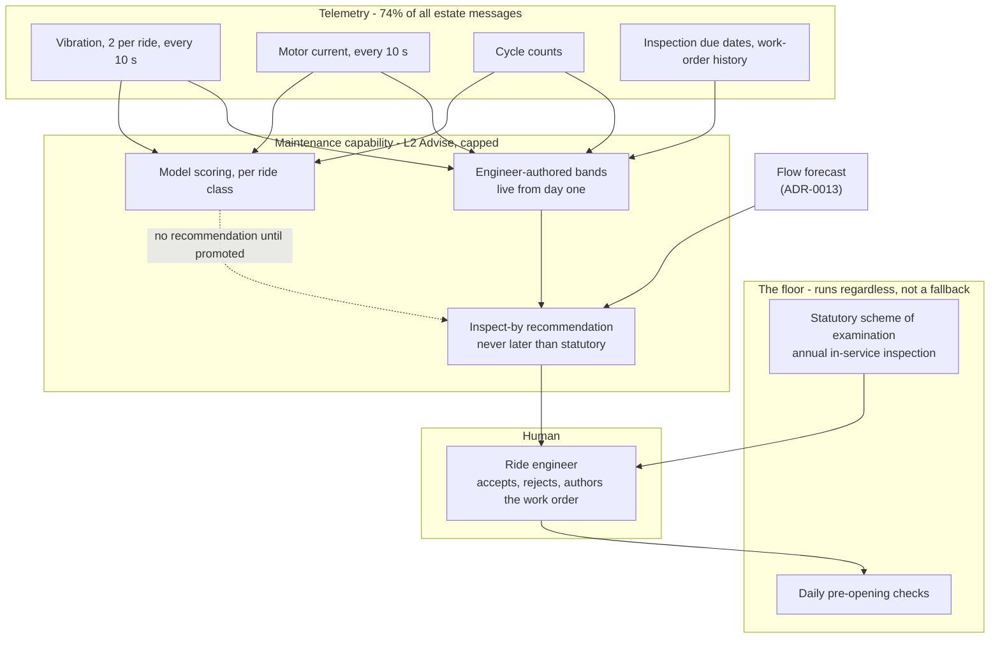

# ADR-0014 - Predictive ride maintenance may pull an inspection forward and may never push one back

## Date

2026-09-14

## Status

Proposed

## Context

Forty rides, most of them historic, carrying the public. `FR#2K` asks for predictive maintenance and inspect-before-peak alerts from MQTT heartbeats - vibration, motor current, gate sensors, e-stop - plus cycle counts, inspection-due dates, and work-order history.

This is the most obviously attractive AI use case in the brief and the most dangerous one, and both for the same reason: **a ride that fails in service injures people.** Everything in this record follows from taking that seriously rather than from taking it as motivation.

The decisive fact is one the brief does not mention and that changes the whole shape of the problem: **amusement rides already have a mandatory inspection regime.** An estate operating historic rides for the public runs an annual in-service inspection with a competent body, daily pre-opening checks, and a documented scheme of examination. That regime exists, it is legally required, and it is not ours to modify.

So the question is not "can a model predict ride failure?" It is **"what may a model be allowed to change about a safety regime that already works?"** The answer this record gives is: it may make the regime tighter, and it may never make it looser.

The second fact is quieter and comes from [hld/sizing](../hld/sizing.md): the 120 vibration and motor-current sensors on 40 rides publish every ten seconds and account for **12 of the estate's 16.2 messages per second - 74% of all telemetry.** This capability is, by volume, the estate's data platform. It is also the most expensive AI line at $8.03/month ([cost-analysis](../cost-analysis/README.md)). Both figures belong in this record because they are the price of a capability the Countess did not ask for.

This record decides how predictive maintenance is built, bounded, and promoted. It does not decide the sensing hardware, the inspection regime itself, or how work orders are tracked ([hld/core-func/4_Maintenance_and_Intranet](../hld/core-func/4_Maintenance_and_Intranet.md)).

**Foreclosed here:** extending an inspection interval on a model's evidence, a model opening or closing a ride, and AI-authored inspection sign-off.

## Evaluation criteria

- **Cannot weaken the statutory regime (driving)** - the inspection schedule is a floor. No option that lets a model raise that floor's interval is admissible, regardless of accuracy.
- **Bounded failure mode (driving)** - when the model is wrong, the worst outcome must be knowable in advance and must not be "a ride that should have been inspected was not".
- **Useful before failure labels exist** - historic rides fail rarely, which is excellent for the public and terrible for supervised learning. There is no failure history to train on.
- **Engineer attention is budgeted** - two ride engineers cannot triage a queue, and the same attention argument as [ADR-0022](ADR-0022%20-%20Shadow%20before%20promote%20for%20animal%20health%20anomaly%20detection.md) applies.
- **Cost (NFR_12)** - this capability carries 74% of estate telemetry, so its cost case has to be made rather than assumed.

## Options

- **Option A - No predictive maintenance**: statutory inspections and daily checks only, as today.
- **Option B - Condition-based interval adjustment**: the model moves the inspection interval in both directions - tightening when signals degrade, extending when a ride looks healthy.
- **Option C - One-directional advisory behind the schedule (chosen)**: the statutory schedule runs untouched; the model may only recommend inspecting *earlier*, with evidence, for a human to accept.
- **Option D - Per-ride vendor monitoring product**: buy a condition-monitoring package per ride from the ride manufacturers.

| | Cannot weaken statutory (driving) | Bounded failure (driving) | Useful without labels | Attention | Cost |
|---|---|---|---|---|---|
| A None | Pass - by not existing | Pass - no model, no model failure | Pass | Pass | Zero |
| B Bidirectional interval | **Fail** - a false negative now deletes a real inspection, which is the one failure mode that is not available to us | Fail - worst case is an uninspected ride | Fail - extending an interval needs exactly the failure evidence that does not exist | Partial | Medium |
| C One-directional advisory | Pass - the schedule is untouched | Pass - worst case is a wasted inspection, priced below | Pass - starts as engineer-authored vibration bands and cycle-count rules | Pass - budgeted and enforced | Low |
| D Vendor per ride | Partial - depends on 40 contracts | Partial - opaque models, no shared eval | Partial | **Fail** - forty dashboards for two engineers | High |

Not options: autonomous ride closure or evacuation (`NFR_7`, and a closure is an evacuation decision with people on a ride); AI-generated inspection sign-off (the competent person signs, not the estate and certainly not a model); replacing daily pre-opening checks with telemetry.

## Decision

**The statutory inspection schedule runs regardless. The model may recommend inspecting earlier, with evidence, for an engineer to accept. It may never recommend inspecting later, and it may never open or close a ride.**



Five rules follow.

**The schedule is a floor, not a fallback.** Every other AI capability in this estate has a fallback that engages when the model is unavailable. This one has a *floor* that runs whether the model is available or not. The distinction matters: a fallback is what you get when something fails, and a floor is what you get always. If this capability is switched off, deleted, or never built, the rides are inspected exactly as often as the law requires.

**The output is one-directional.** A recommendation is always of the form *"inspect ride 14 by Thursday"*, where Thursday is earlier than the scheduled date. There is no code path that emits a date later than the statutory one, and [evals/ride-maintenance](../evals/ride-maintenance/README.md) asserts its absence rather than its correctness.

**Promotion is per ride class, not per ride.** Forty rides fall into roughly six mechanical classes - rotary, pendulum, tracked, water, carousel, tower. A class shares a failure vocabulary and pools enough observations to be learnable; a single ride does not. This is the same per-subject-type promotion pattern as [ADR-0022](ADR-0022%20-%20Shadow%20before%20promote%20for%20animal%20health%20anomaly%20detection.md), for the same reason: uniform promotion across dissimilar subjects means promoting something somewhere it has not earned it.

**Inspect-before-peak is where this capability pays for itself.** A needed inspection still has to happen; the question is when. The capability reads the congestion forecast from [ADR-0013](ADR-0013%20-%20Popularity%20and%20flow%20as%20advisory%20signals%20that%20degrade%20to%20unknown.md) and places the work in the lowest-demand window that is still earlier than the deadline - and surfaces **yield-at-risk** when a popular ride's inspection cannot avoid a peak. This is the connection `FR#2K` asks for, and it is the only part of this capability that is specific to this estate rather than generic condition monitoring.

**Authority is L2 Advise, capped permanently** ([ADR-0005](ADR-0005%20-%20Human-in-the-loop%20authority%20for%20estate%20AI.md)). The engineer accepts or rejects with a reason code and authors the work order. No accuracy figure promotes this past L2, because the thing above L2 is a machine deciding when a ride carrying children is safe.

Non-weakening and bounded failure decided it. Option B is the tempting one and it is the reason this record exists: condition-based interval extension is standard industrial practice, it is where the money is, and it is unavailable here because the failure mode is a ride that should have been inspected and was not. Option A is honest and is what phase 1 ships; it loses as a destination because vibration signatures genuinely do degrade before failure and ignoring them is a choice too. Option D fails on operability before it fails on anything else.

## The cost asymmetry, and why it points the opposite way to animal health

[ADR-0022](ADR-0022%20-%20Shadow%20before%20promote%20for%20animal%20health%20anomaly%20detection.md) found a 182:1 ratio between a missed illness and a false alarm, and concluded that welfare alerting should be aggressive. The same arithmetic here gives a different answer, and the difference is instructive.

| # | Assumption | Value |
|:--|:--|:--|
| M1 | Ride engineer, loaded | £45/hour |
| M2 | Unplanned inspection triggered by a recommendation | 2 hours |
| M3 | Displaced guest experience from closing a ride for 2 hours in opening time | £250 |
| M4 | Cost of an in-service failure: emergency closure, evacuation, investigation, reputational damage | £15,000 |
| M5 | Probability that a developing fault the model could see progresses to in-service failure **before the next statutory inspection would have caught it** | 10% |
| M6 | Genuine developing faults per ride per year, historic rides | 4, so 160/year across 40 rides |

```
FALSE POSITIVE  = 2 h x £45 (M1, M2) + £250 (M3)              =    £340
FALSE NEGATIVE  = 10% (M5) x £15,000 (M4)                     =  £1,500

                                             ratio  =  4.4 : 1
                        implied alert threshold  =  340 / 1,500  =  22.7%
```

**4.4:1 here against 182:1 for animal health, so the alert threshold is 22.7% against 0.55% - forty-one times more conservative.**

The reason is entirely structural and it is the most important sentence in this record. **M5 is small because the statutory inspection is a guaranteed backstop.** A miss here does not mean the fault goes undetected; it means the fault is detected by the annual inspection instead of by telemetry, which is what would have happened anyway. The model is not the safeguard, so the cost of its failure is bounded by the schedule behind it.

A sick animal has no annual inspection. That is why welfare alerting is aggressive and ride alerting is conservative, and why two capabilities that look identical on a container diagram - telemetry, anomaly scoring, human decision - end up with threshold policies that differ by a factor of forty.

**M4 deliberately excludes injury.** It is not priceable, and any number put there would make the ratio arbitrarily large and the threshold arbitrarily low, which is exactly the reasoning that ends with a model being trusted as a safety device. Injury is handled by the statutory regime and by the daily checks, not by this capability. That is the whole design.

### The attention budget

```
genuine developing faults   = 160/year (M6)                    = 0.44/day
at 22.7% precision          = 0.44 / 0.227                     = 1.9 alerts/day
```

**The budget is 2 recommendations per day across 40 rides**, hard cap 4. Two ride engineers can investigate that within a shift alongside their existing work. Above the cap the capability raises its threshold and records that it did.

## Key differentiators

- **The worst case is a wasted inspection.** Every other framing of predictive maintenance has "a missed failure" as its worst case; the one-directional rule removes that outcome from the design rather than mitigating it.
- **A safety-critical AI capability with a legally guaranteed backstop** is a genuinely different engineering problem from one without, and this record prices the difference instead of assuming the harder case.
- **The capability is useful with zero failure labels,** because engineer-authored vibration bands and cycle-count thresholds are the day-one product and they generate the labels a model would eventually need.
- **Inspect-before-peak turns a cost into a yield decision,** using the flow forecast the estate already computes for a different purpose.
- **It can be deleted without a safety consequence,** which is a property worth having in the one capability that touches public safety.

## Architecture characteristics

| Characteristic | Effect | Why |
|---|---|---|
| Safety | **Improved (driving)** | The statutory floor is untouchable in code; the worst model failure is a redundant inspection (`NFR_7`). |
| Bounded blast radius | **Improved (driving)** | One-directional output means no model error removes an inspection. |
| Auditability | **Improved** | Every recommendation carries evidence and an engineer decision; work orders are human-authored (`NFR_7`). |
| Testability | **Improved** | The central property is a negative one - no output later than statutory - which is directly assertable. |
| Fault tolerance | **Improved** | The floor runs when the capability does not ([ADR-0004](ADR-0004%20-%20Vertex%20AI%20behind%20a%20capability%20interface.md)). |
| Cost efficiency | **Weakened (deliberate)** | 74% of estate telemetry and the largest single AI line, for the capability with the most bounded upside. |
| Recall | **Weakened (deliberate)** | A 22.7% threshold misses developing faults that a 0.55% threshold would catch. Accepted because the schedule catches them. |
| Operational complexity | **Weakened** | 120 vibration and current sensors on historic machinery become estate assets with a calibration rota. |

**Deliberately downplayed: recall, and unusually, we are comfortable about it.** A conservative threshold means this capability will miss developing faults. In [ADR-0022](ADR-0022%20-%20Shadow%20before%20promote%20for%20animal%20health%20anomaly%20detection.md) the same admission was uncomfortable, because a missed animal is a missed animal. Here the miss is caught by an inspection that was going to happen anyway. The honest way to say it: **this capability buys earliness, not detection**, and earliness is worth less than detection, which is why it is phased last and why its threshold is high.

**Fit with the existing architecture.** Scoring is asynchronous and reads the warehouse; nothing on a ride waits for it, and a ride's open/closed state is deterministic and human-authored exactly as before ([hld/README](../hld/README.md)). The recommendation lands in the same evidence-carrying, human-decided inbox pattern as animal health, on the same intranet, with the same confidence and freshness contract ([ADR-0004](ADR-0004%20-%20Vertex%20AI%20behind%20a%20capability%20interface.md)). E-stop and ride-status remain on the deterministic path and are not inputs this capability can influence.

## Consequences

### Positive

- No model error can result in an uninspected ride (driving criterion).
- The worst case is £340 and is knowable before the capability is built (driving criterion).
- The capability ships useful on day one as engineer-authored bands, and those bands generate the labels.
- Inspections land in low-demand windows, so maintenance stops competing with the popular-ride experience.
- Yield-at-risk becomes visible when an inspection cannot avoid a peak, which is a commercial conversation the estate currently has no data for.

### Negative

- **This capability consumes 74% of estate telemetry and the largest AI line in the budget**, for a benefit bounded by the inspection regime behind it. That is a genuinely poor ratio and it is the reason this is phased last. If ingest cost ever needs to fall, the 10-second vibration sampling is the first thing to look at ([hld/sizing](../hld/sizing.md#2-message-rate)).
- **120 vibration and motor-current sensors mounted on 18th-century machinery** need fixing points, calibration, and a rota. Historic fabric and modern instrumentation is a conservation question as much as an engineering one, and the estate has not asked anyone about it.
- A conservative threshold means real developing faults are missed by this capability. That is accepted, and it is only acceptable because of the floor.
- Engineers may come to treat the absence of a recommendation as evidence of health. It is not, and the intranet has to say so on the screen rather than in a training session.
- Per-class promotion means some ride classes never get a model, so the capability's quality is uneven across the estate in the same way animal health's is across the collection.

## Risks & trade-offs

| Risk area | Description | Mitigation |
|---|---|---|
| Interval creep | Pressure to use the model to justify extending an inspection interval, because that is where the savings are | Foreclosed in this record and asserted in CI: no code path emits a date later than statutory. The test asserts the absence of the path, not the correctness of the date |
| Model treated as a safety device | "The system would have told us" becomes an excuse | Authority capped at L2; intranet states that absence of a recommendation is not evidence of health; daily checks unchanged |
| No failure labels | Historic rides rarely fail, so supervised learning has nothing to learn from | Engineer-authored bands are the day-one product; per-class pooling; shadow until a class has evidence |
| Sensor mounting on historic fabric | Instrumentation damages or devalues a listed asset | Conservation review before fitting; non-invasive mounting; this is a precondition, not a mitigation |
| Alert fatigue | Two engineers, a queue they stop reading | Budget of 2/day, hard cap 4; threshold rise recorded; accept rate monitored |
| False confidence from cycle counts | Cycle count is a proxy for wear and a poor one for a ride that sat idle in winter | Cycle counts are a covariate, never a sole trigger; seasonal baselines per class |
| Telemetry cost | 74% of ingest for the least certain benefit | Reviewed at the first budget checkpoint; sampling rate is the lever ([cost-analysis](../cost-analysis/README.md)) |
| Conflation with e-stop | A maintenance signal accidentally entering a safety path | E-stop and ride status are deterministic and are not outputs of this capability; CI asserts the separation |

## Verification

**Primary metrics**

- **Lead time gained**: days between a recommendation and the date the statutory inspection would have caught the same fault. This is the capability's entire value, so it is the number that decides whether it survives.
- Recommendations per day against the budget of 2.
- Engineer accept rate and reject reason distribution.
- False-positive rate against engineer-confirmed findings, and missed faults later found at statutory inspection - the eval pair `FR#2K` names.
- Share of accepted inspections placed in a below-median-demand window (the inspect-before-peak value).
- Yield-at-risk surfaced when a popular ride's inspection cannot avoid a peak.

**Tests (CI)** - golden cases in [`evals/ride-maintenance/`](../evals/ride-maintenance/)

- **No code path produces an inspect-by date later than the statutory date.** The test asserts the path does not exist.
- A model in shadow for a ride class produces no engineer-visible recommendation.
- No code path sets ride open/closed state, issues an e-stop, or clears one.
- A work order cannot be created without an engineer decision.
- Recommendations exceeding the daily cap fail the eval rather than being delivered.
- A recommendation published without confidence, contributing signals, and input freshness is rejected.
- A gapped vibration feed scores as unknown, not as a healthy reading.
- Cycle count alone never triggers a recommendation.
- A drift alarm demotes the ride class to engineer-authored bands automatically.
- Promotion for a class requires recorded shadow duration, confirmed-finding count, and volume evidence.

**Ops check**

- Pull a vibration sensor's feed during operation and confirm the ride's panel shows unknown rather than healthy.
- An engineer confirms a recommendation is actionable from its evidence alone, without opening the warehouse.
- Confirm with the competent body that nothing in this capability's output is admissible as a reason to vary the scheme of examination.

**Open questions**

- The six ride classes and which rides belong to each - with the ride engineers, before instrumentation.
- M4 and M5, the in-service failure cost and the progression probability - with the insurer, who has better numbers than we do, before the threshold is fixed.
- Whether historic-fabric conservation permits sensor mounting on every ride - with a conservation officer, before procurement. **This can veto the capability entirely, and nothing else in this record matters if it does.**
- Minimum shadow duration and confirmed-finding count per ride class for promotion.
- Whether 10-second vibration sampling is necessary or whether 60-second sampling carries the same signal - this is worth 83% of the estate's ingest volume and nobody has tested it.

**Revisit triggers**

- Lead time gained is consistently under a week - the capability is not buying earliness and should be retired, keeping the bands.
- A ride class fails to beat engineer-authored bands after a full season - retire the model for that class, which is a legitimate outcome.
- Sampling-rate analysis shows 60-second vibration is sufficient - re-cost the whole ingest pipeline.
- The insurer offers a premium reduction for condition monitoring - that changes the cost case materially and this record should be re-argued with real numbers.
- Any pressure to vary an inspection interval on model evidence - this record is the answer, and the answer is no.

## Conclusion

Predictive ride maintenance runs behind the statutory inspection schedule rather than in place of it: engineer-authored vibration and cycle bands from day one, a model in shadow promoted per ride class, and an output that can only ever pull an inspection forward. Chosen because the one failure mode unavailable to us is a ride that should have been inspected and was not, and one-directionality removes that outcome from the design entirely. The accepted costs are a conservative threshold that misses real faults, 74% of estate telemetry spent on the capability with the most bounded upside, and instrumentation on historic fabric that conservation may yet refuse - the first two accepted because the inspection regime catches what we miss, and the third genuinely unresolved.

Related: [ADR-0022](ADR-0022%20-%20Shadow%20before%20promote%20for%20animal%20health%20anomaly%20detection.md) (the shadow-before-promote pattern this reuses, and the cost asymmetry it inverts), [ADR-0005](ADR-0005%20-%20Human-in-the-loop%20authority%20for%20estate%20AI.md) (L2 cap), [ADR-0013](ADR-0013%20-%20Popularity%20and%20flow%20as%20advisory%20signals%20that%20degrade%20to%20unknown.md) (the forecast that places inspections off-peak), [ADR-0003](ADR-0003%20-%20MQTT%20gateways%20as%20the%20estate-to-cloud%20path.md) (the telemetry this consumes), [hld/core-func/4_Maintenance_and_Intranet](../hld/core-func/4_Maintenance_and_Intranet.md), [hld/sizing](../hld/sizing.md), [cost-analysis](../cost-analysis/README.md), golden cases in [`evals/ride-maintenance/`](../evals/ride-maintenance/).
