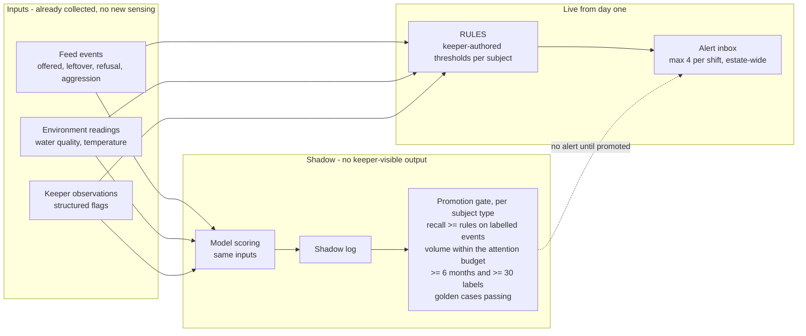

# ADR-0022 - Rules first, model in shadow, and promotion is earned per subject type

## Date

2026-09-14

## Status

Proposed

## Context

Looking after 200+ exotic and poisonous animals is expensive, and much worse when they get sick. The brief asks for ways of tracking animal health and how much and how well they are eating. FR#2I wants anomalies detected across 55 displays, with high recall first, keeper accept/reject as the training signal, and never an autonomous welfare decision.

The hard part is not the model. It is that **there is no training data and no labels**. Nobody has ever recorded this collection's feeding behaviour in a structured way, so on day one there is no history, no notion of normal, and no examples of illness. A supervised model has nothing to learn from.

The species diversity makes it worse. A reticulated python eats once a fortnight; a colony of piranha eats daily; an aquatic invertebrate's baseline is different again. "Ate less than usual" is not one distribution - it is dozens, most with a handful of observations. A single model across 55 displays would be learning an average of incompatible behaviours.

And the cost of errors is asymmetric in a specific way. A missed sick animal is suffering and expense - so recall matters. But a flood of false alarms trains keepers to ignore the inbox, and then the true positive is missed too, with the system having consumed attention on the way. Recall bought with noise is not recall.

This record decides how anomaly detection is built and promoted. It does not decide the subject model ([ADR-0020](ADR-0020%20-%20Enclosure%20and%20colony%20as%20the%20care%20subject.md)), the keeper data path ([ADR-0021](ADR-0021%20-%20Keeper%20field%20events%20are%20append-only%20and%20offline-first.md)), or population estimation ([ADR-0023](ADR-0023%20-%20Anchor%20aquatic%20population%20on%20human%20census.md)).

**Foreclosed here:** a model alerting keepers before it has run in shadow against that subject type, and any autonomous welfare action at any confidence.

## Evaluation criteria

- **Useful on day one with no labels (driving)** - the collection opens to the public before any model can be trained.
- **Keeper trust preserved (driving)** - alert volume must stay inside the attention budget, because a queue nobody reads is worse than no queue.
- **Recall on genuine illness** - measured against keeper-labelled events, and it is the reason the capability exists.
- **Handles species heterogeneity** - a fortnightly feeder and a daily colony cannot share one threshold.
- **Cost (NFR_12)** - no vision by default; this runs on feed and environment data the platform already collects.

## Options

- **Option A - Deterministic rules only**: keeper-set thresholds per subject, no model ever.
- **Option B - Model from the start**: train on whatever accumulates and alert from launch.
- **Option C - Rules in production, model in shadow, promotion per subject type (chosen)**: rules alert from day one; the model scores in parallel without alerting; it is promoted only for subject types where it demonstrably beats the rules inside the attention budget.
- **Option D - Vision-based behavioural monitoring**: cameras on enclosures, model watches behaviour.

| | Useful day one (driving) | Keeper trust (driving) | Recall | Heterogeneity | Cost |
|---|---|---|---|---|---|
| A Rules only | Pass | Pass - predictable, keeper-authored | Partial - misses subtle multi-signal patterns | Pass - per subject by construction | Low |
| B Model from start | Fail - no labels, no baseline | Fail - unvalidated volume destroys the inbox immediately | Unknown | Fail - one model, many distributions | Medium |
| C Rules + shadow model | Pass - rules are the day-one product | Pass - promotion is gated on volume | Pass - measured before it can alert | Pass - promotion is per subject type | Low |
| D Vision | Fail - no labels, needs funding | Partial | Partial | Partial | High |

Not options: autonomous intervention of any kind (no auto-medicate, no auto-cull, no auto-resolve - foreclosed here and capped at L2 in [ADR-0005](ADR-0005%20-%20Human-in-the-loop%20authority%20for%20estate%20AI.md)); veterinary imaging models per species ([Appendix C](../requirements/Appendix%20C_%20Future%20scope.md)).

## Decision

**Deterministic rules alert from day one. The model scores in shadow beside them and is promoted only for subject types where it beats the rules while staying inside the keeper attention budget.**



Four rules follow.

**Rules are the product, not a placeholder.** Keepers already know that this python eats fortnightly and that water temperature outside a band is a problem. Encoding that is high-value, immediately, and needs no data science. It also generates the labels the model will eventually need, which is the only way out of the cold start.

**Promotion is per subject type, and partial promotion is the expected end state.** The model may beat the rules for daily-feeding colonies where there is signal density, and never beat them for a fortnightly feeder where each data point is a fortnight apart. That is a legitimate outcome: some subject types stay on rules forever. Forcing uniform coverage would mean promoting a model somewhere it has not earned it.

**Every alert carries evidence, confidence, and the specific signals that fired.** A keeper triaging an inbox needs to see "leftover 60% above the trailing norm for three consecutive feeds, water temperature within band" in order to decide in seconds. An alert that says only "anomaly detected, 0.83" costs more attention than it saves.

**Duplicate alerts on the same subject are suppressed into one open case.** Three days of refusal is one case with a worsening trend, not three alerts. This is where most of the attention budget is won or lost.

Authority is **L2 Advise, capped permanently** ([ADR-0005](ADR-0005%20-%20Human-in-the-loop%20authority%20for%20estate%20AI.md)). Keepers confirm or reject with a reason code; escalation to the vet is a keeper decision; no amount of accuracy promotes this past L2.

Day-one usefulness and trust preservation decided it. Model-from-start (B) fails both: there is nothing to train on, and an unvalidated alert stream destroys the inbox in its first week - after which no later improvement recovers the keepers' attention. Rules-only (A) is genuinely defensible and is what phase 1 ships; it loses as a destination because it cannot combine weak multi-signal evidence, which is exactly where early illness hides. Vision (D) needs labels it cannot have and money that is better spent elsewhere.

## The cost asymmetry, and the attention budget it sets

A missed sick animal and a vet called out for nothing are not the same size of mistake, and until that difference has a number the operating threshold is a matter of taste. This section gives it one.

Every figure is an assumption to be replaced by the vet's and the keepers' real numbers. They are stated so that replacing them is a matter of editing a row rather than redoing the reasoning.

| # | Assumption | Value |
|:--|:--|:--|
| W1 | Vet call-out, exotic specialist, in hours | £250 |
| W2 | Vet call-out, out of hours | £600 |
| W3 | Keeper time, loaded | £22/hour, so £0.37/minute |
| W4 | Triage at the screen, with evidence shown | 3 minutes |
| W5 | Triage requiring a physical check of the animal | 12 minutes |
| W6 | Share of alerts needing a physical check | 40% |
| W7 | Share of false alarms that survive triage and pull in a vet | 1% |
| W8 | Treatment cost, illness caught early | £150 |
| W9 | Treatment cost, same illness caught late | £900 |
| W10 | Mean replacement value across the collection | £3,000 |
| W11 | Probability a missed early signal escalates to late-caught | 60% |
| W12 | Probability a missed early signal ends in death | 15% |
| W13 | Genuine actionable welfare events per subject per year | 6, so 330/year across 55 subjects |
| W14 | Keepers on shift, and minutes each can give the inbox without displacing animal care | 6 keepers, 20 minutes each |

### The two costs

```
mean triage        = 0.6 x 3 min (W4, W6) + 0.4 x 12 min (W5, W6)   = 6.6 minutes

FALSE POSITIVE     = 6.6 min x £0.37 (W3)                           =  £2.44
                   + 1% (W7) x £250 (W1)                            =  £2.50
                                                                      -------
                                                                       £4.94

FALSE NEGATIVE     = 60% (W11) x (£900 - £150) (W8, W9)             = £450.00
                   + 15% (W12) x £3,000 (W10)                       = £450.00
                                                                      -------
                                                                      £900.00
```

**A miss costs 182 times a false alarm.** That single ratio does most of the work in this record.

Taken literally it says: alert whenever the probability of illness exceeds **£4.94 / £900 = 0.55%**. That is what "high recall first" in `FR#2I` means once it is priced, and it is a far lower bar than intuition suggests.

### Why the economically optimal threshold is not 0.55%

Because that calculation assumes every alert gets a keeper's full attention, and attention is not free of volume. A keeper who finds the inbox useless stops reading it, and **a dead inbox converts true positives into false negatives.** So recall has to be multiplied by the probability the alert is actually acted on.

Assuming an attention curve to be calibrated with keepers during shadow - this is the softest input here, and it is the one that decides the answer:

| Alerts/shift | Alerts/year | Model recall | Keeper attention | Genuine events caught | Missed | Cost of misses | Cost of false alarms | **Total** | Precision |
|--:|--:|--:|--:|--:|--:|--:|--:|--:|--:|
| 1 | 730 | 0.45 | 0.97 | 144 | 186 | £167,360 | £2,874 | £170,233 | 20.3% |
| 2 | 1,460 | 0.55 | 0.95 | 172 | 158 | £141,818 | £6,318 | £148,136 | 12.4% |
| 3 | 2,190 | 0.62 | 0.92 | 188 | 142 | £127,591 | £9,812 | £137,403 | 9.3% |
| **4** | **2,920** | **0.68** | **0.88** | **197** | **133** | **£119,275** | **£13,322** | **£132,597** | **7.7%** |
| 6 | 4,380 | 0.75 | 0.80 | 198 | 132 | £118,800 | £20,423 | £139,223 | 5.7% |
| 12 | 8,760 | 0.85 | 0.55 | 154 | 176 | £158,153 | £41,906 | £200,058 | 3.2% |
| 24 | 17,520 | 0.92 | 0.25 | 76 | 254 | £228,690 | £85,083 | £313,773 | 1.7% |

**The attention budget is 4 alerts per shift, estate-wide.** Hard cap 6; above that the capability raises its threshold and records that it did.

Three things in that table are worth reading twice.

- **Pushing recall past the optimum makes welfare worse, not just noisier.** At 24 alerts a shift the model finds 92% of genuine events and the collection catches 76 of them, against 197 at the budget. The firehose is not a trade of money for welfare. It is a loss of both.
- **The binding constraint is not keeper time.** Four alerts costs 26 of the 120 keeper-minutes available (W14). There is room for eighteen. The inbox is small because illness is rare, not because keepers are busy - which is the opposite of how alert budgets are usually set.
- **Precision at the budget is 7.7%, or one genuine case in thirteen.** That looks like a broken system and it is the correct operating point, because a miss costs 182 times a wasted triage. Keepers must be told this number during setup, because a keeper who expects the inbox to be usually right will lose faith in a system that is working exactly as designed.

### What the budget is worth

Rules alone, at roughly 2 alerts a shift and 0.55 recall, cost £148,136 a year in misses and wasted triage. At the budget the same collection costs £132,597. **The model is worth about £15,500 a year**, against the £5 a month of cloud it consumes ([cost-analysis](../cost-analysis/README.md#3-model-training-and-scoring)). That ratio is the argument for building it at all, and it is also why this record can afford to be so conservative about promoting it.

### What this unblocks

| Open question | Answer it forces |
|:--|:--|
| Attention budget per keeper per shift | **4 per shift estate-wide**, hard cap 6. Averaged over 6 keepers that is one alert each, every other shift. |
| Minimum shadow duration and label count | A subject type covering 10 subjects generates 60 genuine events a year (W13). Estimating recall to a useful confidence needs about 30 labelled events, so **6 months and 30 labels minimum** before any subject type can be promoted. |
| Overnight escalation path | Waking a vet costs £600 (W2); the miss it prevents costs £900. So escalate out of hours only above **67% confidence**, and let everything below that wait for the morning round. A policy, not a preference. |
| Starter thresholds per subject type | Each subject type's threshold is set so the **aggregate** stays under 4 a shift, allocated by risk rather than evenly - a high-risk subject may consume a quarter of the budget alone, and a robust one may be allowed none. |

## Key differentiators

- **The capability is useful before any model exists,** and the rules generate the labels the model needs.
- **Promotion is earned per subject type,** so a model is never trusted for a species where it has no evidence.
- **Alert volume is a promotion gate, not an afterthought,** which protects the only scarce resource in the animal house - keeper attention.
- **Case suppression means a deteriorating animal is one worsening case,** matching how keepers actually think.
- **Keeper rejects are structured signal,** so the loop improves the thing that gates it.

## Architecture characteristics

| Characteristic | Effect | Why |
|---|---|---|
| Safety | **Improved (driving)** | No autonomous welfare action; keeper and vet retain authority (NFR_7, NFR_15). |
| Trustworthiness | **Improved (driving)** | Volume caps and evidence-rich alerts keep the inbox worth reading (NFR_11). |
| Testability | **Improved** | Rules are deterministic and directly testable; the model is measured against them before it can alert (NFR_13). |
| Fault tolerance | **Improved** | Rules are the named fallback and always available ([ADR-0004](ADR-0004%20-%20Vertex%20AI%20behind%20a%20capability%20interface.md)). |
| Cost efficiency | **Improved** | Runs on already-collected feed and environment data; no vision. |
| Detection latency | **Weakened (deliberate)** | An L2 alert waits for a keeper. Overnight anomalies wait for the morning round unless escalated. |
| Recall in the rules era | **Weakened** | Thresholds miss subtle multi-signal patterns, which is the gap the model is meant to close. |
| Coverage uniformity | **Weakened** | Some subject types stay on rules indefinitely, so capability quality varies across the collection. |

**Deliberately downplayed: recall, in two places.** First, rules-era recall is lower than a good model's would be. Second, and more uncomfortable: when a capability hits its attention budget it raises its threshold, which suppresses some true positives. We accept both because the alternative - a high-recall firehose - produces an inbox that is ignored, at which point measured recall is irrelevant because nobody is reading. The mitigation is that recall is tracked as a first-class metric, so a budget-driven threshold rise is visible as a recall cost rather than an invisible saving.

**Fit with the existing architecture.** The scoring job reads from the warehouse and writes to an alert inbox; it holds no animal state and changes none, exactly like every other capability in [hld/README](../hld/README.md). Keeper-confirmed facts outrank model output ([ADR-0021](ADR-0021%20-%20Keeper%20field%20events%20are%20append-only%20and%20offline-first.md)), which is the same precedence the gate uses for a valid entitlement. The alert inbox lives on the offline-capable keeper surfaces rather than in a separate AI product (NFR_15).

## Consequences

### Positive

- The collection can open with anomaly detection running from day one (driving criterion).
- Keeper attention is protected by an enforced volume cap (driving criterion).
- Rules produce the labelled history the model needs, so the cold start has an exit.
- The fallback is always live, because it is the day-one product.

### Negative

- **Overnight anomalies wait for a human.** An L2 capability cannot act, so a refusal detected at 2am surfaces on the morning round unless an on-call escalation path exists - which is a staffing question the estate has not answered ([ADR-0005](ADR-0005%20-%20Human-in-the-loop%20authority%20for%20estate%20AI.md) open question).
- **Capability quality will be uneven across the collection,** and keepers working across species will find the system smarter about some animals than others. That is honest but confusing, and it needs explaining rather than hiding.
- Threshold raises to meet the attention budget suppress real anomalies; the metric makes it visible but does not make it costless.
- Rules are keeper-authored, so their quality depends on keeper time during setup - a real demand on people who have animals to look after.
- Shadow evaluation needs months of labelled events before promotion is possible for any subject type, so the model's value arrives late.

## Risks & trade-offs

| Risk area | Description | Mitigation |
|---|---|---|
| Missed illness | False negative on a genuinely sick animal | Rules err toward sensitivity for high-risk subjects; recall tracked against keeper-labelled events; keeper rounds remain the primary safeguard, not the system |
| Alert fatigue | Volume erodes trust | Attention budget is a promotion gate; case suppression; evidence shown for fast triage; accept rate monitored as drift |
| Suppressed true positive | Threshold raised to fit the budget | Recall reported per period; a recall drop is a capability failure requiring a fix, not an accepted saving |
| Confounded signals | Temperature, season, or breeding move consumption without illness | Environment as covariates; seasonal baselines per subject; consumption alone never triggers a population claim ([ADR-0023](ADR-0023%20-%20Anchor%20aquatic%20population%20on%20human%20census.md)) |
| Protocol non-compliance | Missing leftover data degrades the signal | Consumption inference disabled for subjects whose protocol lapses ([ADR-0021](ADR-0021%20-%20Keeper%20field%20events%20are%20append-only%20and%20offline-first.md)) |
| Premature promotion | Model promoted on thin evidence | Minimum shadow duration and label count per subject type; written eval record required |
| Drift after promotion | Seasonal or collection change degrades the model | Scheduled golden-case runs; accept-rate monitoring; automatic demotion to rules on a drift alarm |
| Rules never authored | Setup demand on keeper time is not met | Starter thresholds from published husbandry guidance, reviewed rather than authored from scratch |

## Verification

**Primary metrics**

- **Recall against keeper-labelled health events**, tracked per period and per subject type (OKR 5.1).
- **Alert volume per keeper per shift**, against the attention budget.
- Accept rate and reject reason distribution - the drift indicator.
- Time-to-detect a keeper-confirmed anomaly, versus the paper-round baseline (OKR 5.1).
- Shadow model recall and volume versus rules, per subject type - the promotion evidence.

**Tests (CI)** - golden cases in [`evals/animal-health/`](../evals/animal-health/)

- A model in shadow never produces a keeper-visible alert.
- Promotion requires recorded shadow duration, label count, recall versus rules, and volume within budget; a missing element blocks promotion.
- Alert volume exceeding the shift budget fails the eval rather than being delivered.
- Repeat anomalies on one subject collapse into a single open case with a trend.
- Every alert carries confidence, evidence, contributing signals, and input freshness.
- No code path lets an alert be resolved without a keeper decision.
- A drift alarm demotes the subject type to rules automatically.
- A subject with incomplete feed protocol data is excluded from consumption-based scoring.

**Ops check**

- Keepers confirm the inbox is workable in a real shift, including in an animal house with the uplink down.
- Injected golden cases confirm keepers are still discriminating rather than accepting by reflex.

**Open questions**

- ~~Attention budget per keeper per shift - with keepers, before anything leaves shadow. This is the number the whole record depends on.~~ **Answered above: 4 alerts per shift estate-wide, hard cap 6.** Derived from a 182:1 miss-to-false-alarm cost ratio against an assumed attention curve. Still to be confirmed with keepers, but the number to argue with now exists.
- ~~Starter thresholds per subject type - with keepers and the vet, before the collection opens.~~ **Constrained above:** thresholds are set so the aggregate stays under 4 a shift, allocated by risk rather than evenly. The per-subject values remain a keeper-and-vet exercise; the budget they must fit inside no longer is.
- ~~Minimum shadow duration and label count for promotion - before the first promotion.~~ **Answered above: 6 months and 30 labelled events per subject type**, from a base rate of 6 genuine events per subject per year.
- ~~Overnight escalation path for high-risk subjects - with the Countess, before the collection opens.~~ **Answered above: escalate out of hours above 67% confidence**, because an out-of-hours call-out costs £600 against a £900 miss. The staffing arrangement behind it is still the Countess's decision; the trigger is not.
- Reject reason taxonomy - with keepers ([ADR-0005](ADR-0005%20-%20Human-in-the-loop%20authority%20for%20estate%20AI.md) open question). The minimum set is whatever lets precision be computed per subject type, since that is the input the budget above is most sensitive to.
- The attention curve itself - the softest input in the cost model, and the one that moves the budget. Calibrated during shadow by measuring accept rate against delivered volume, which the capability already records.

**Revisit triggers**

- Accept rate above roughly 95% with no rejections - nobody is reading; investigate before trusting.
- Recall falls while volume stays inside budget - the threshold is hiding the problem.
- The model fails to beat rules for any subject type after a full season - retire the model and keep the rules, which is a legitimate outcome.
- A high-value subject type needs faster-than-human response - that is an argument for a deterministic alarm, not for promoting this capability past L2.

## Conclusion

Keeper-authored deterministic rules alert from day one and remain the permanent fallback; the model scores in shadow and is promoted only for subject types where it beats those rules while staying inside the keeper attention budget. Chosen because there are no labels on day one and because an unvalidated alert stream would destroy keeper trust before any model could earn it. The accepted costs are lower rules-era recall, uneven capability quality across a very mixed collection, and welfare response that waits for a human - the last being deliberate, since genuine emergencies travel deterministic alarm paths instead.

Related: [ADR-0020](ADR-0020%20-%20Enclosure%20and%20colony%20as%20the%20care%20subject.md), [ADR-0021](ADR-0021%20-%20Keeper%20field%20events%20are%20append-only%20and%20offline-first.md), [ADR-0023](ADR-0023%20-%20Anchor%20aquatic%20population%20on%20human%20census.md) (reuses this promotion pattern), [ADR-0005](ADR-0005%20-%20Human-in-the-loop%20authority%20for%20estate%20AI.md) (L2 cap), golden cases in [`evals/animal-health/`](../evals/animal-health/).
