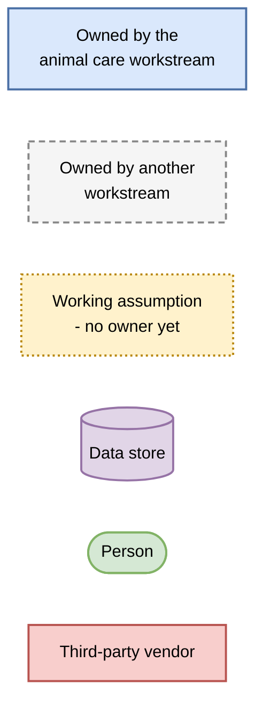
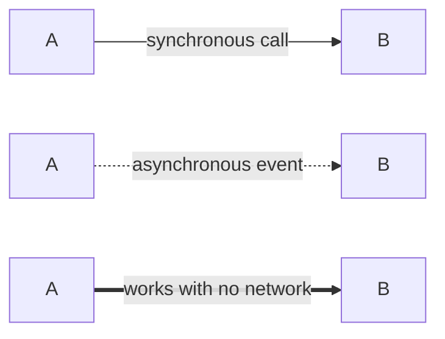

# Legend

Every diagram in this folder uses the shapes and lines below. The kata briefing asks for a key wherever shapes mean different things, so this file is the key and nothing else.

Diagrams are Mermaid in Markdown, which GitHub renders inline and git can diff. PNG exports of every diagram are in [`png/`](png/) as a fallback for viewers that do not render Mermaid.

## Shapes

| Shape | Meaning |
|---|---|
| Solid blue box | Owned by the animal care workstream. We design it, we write its ADR. |
| Dashed grey box | Owned by another workstream - the ops intranet or ticketing. We publish a contract to it; we do not build it. |
| Dotted amber box | A working assumption with **no owner in this repository**. Named so a reader sees the seam rather than assuming it was designed. |
| Purple cylinder | Data store. |
| Green rounded box | A person. |
| Red box | A third-party vendor, always behind an interface we control. |

## Lines

| Line | Meaning |
|---|---|
| Solid arrow | A synchronous call. The caller waits. |
| Dashed arrow | An asynchronous event or message. The sender does not wait and delivery may be delayed. |
| Thick arrow | **This path works with no network.** Patchy Wi-Fi is the estate's hardest constraint, so it is drawn rather than described. |

## Diagram index

| Diagram | Level | Shows |
|---|---|---|
| [c2-containers-animal-care](c2-containers-animal-care.md) | C4 container | What runs where, and which parts survive an outage |
| [c3-components-animal-care](c3-components-animal-care.md) | C4 component | Inside the Animal Care Service |
| [ai-animal-health-anomaly](ai-animal-health-anomaly.md) | Targeted AI view | FR 2I - the tier ladder, the label loop, the vendor boundary |
| [ai-piranha-population](ai-piranha-population.md) | Targeted AI view | FR 2J - census anchor, widening interval, shadow vision |
| [seq-offline-observation-to-label](seq-offline-observation-to-label.md) | Sequence | A keeper observation from a dead zone to a training label |

Decisions behind these views: [ADR-020](../adrs/ADR-020-use-care-subject-as-unit-of-record.md), [ADR-021](../adrs/ADR-021-keep-keeper-observations-off-the-telemetry-path.md), [ADR-022](../adrs/ADR-022-detect-welfare-anomalies-against-per-subject-baselines.md), [ADR-023](../adrs/ADR-023-anchor-piranha-population-on-human-census.md). Boundaries: [animal-care-scope.md](../docs/animal-care-scope.md).
