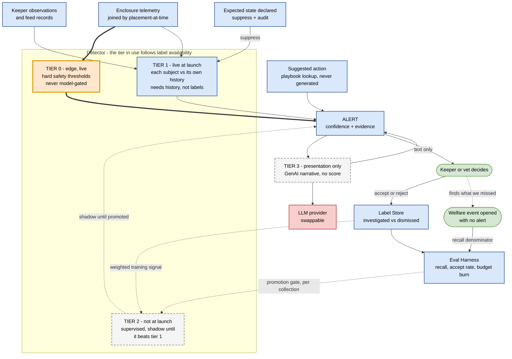

# Targeted AI view - animal health and feeding anomalies (FR 2I)

Key: [00-legend.md](00-legend.md). Decision: [ADR-022](../adrs/ADR-022-detect-welfare-anomalies-against-per-subject-baselines.md). Golden cases: [`evals/animal-health-anomaly/`](../evals/animal-health-anomaly/).

The tier in use is set by **label availability**, not by what is currently fashionable. There were no labelled illness events in existence on day one, so the ladder starts with arithmetic and earns its way up.

## What each tier does, and what happens when it fails

| Tier | Job | If it fails |
|---|---|---|
| 0 - edge safety rules | Hard environment thresholds, evaluated locally | Nothing above it can compensate, which is why it runs at the edge and answers to no model |
| 1 - per-subject baseline | The day-one detector. Compares each subject to its own recent history | Falls back to tier 0. A stale baseline publishes as unknown, never as normal |
| 2 - supervised model | Sensitivity earned from accumulated keeper labels | Falls back to tier 1, which never stopped running. May never arrive for small collections, and that is an accepted outcome |
| 3 - GenAI narrative | Turns existing evidence into readable prose | Falls back to template text assembled from the same fields. The alert is otherwise unchanged |

## The three things this diagram is arguing

**No vendor stands between an animal and a keeper.** The red box connects only to tier 3. If that provider triples its price or shuts down tomorrow, welfare detection is untouched and alerts simply read like a spreadsheet. That is the entire extent of this capability's exposure to the kata's uncertainty question.

**The alert inbox is a labelling machine.** Follow `alert -> keeper -> labels -> tier 2`. Tier 1's second job, arguably its more important one, is manufacturing the labelled dataset tier 2 needs. The ops tool and the training pipeline are the same artefact, so the system earns its way up instead of waiting for a data-collection project nobody would fund.

**Recall needs a denominator the system does not own.** The `unprompted welfare event` box is a keeper opening a case with no alert prompting them. Without that path the detector can only measure its own opinion of itself. It is drawn because it is an architectural requirement, not a reporting detail.

## Verification

Primary metric is recall against keeper- and vet-confirmed events, by collection. Accept rate is the precision proxy. Alert budget burn is tracked alongside both, because recall reported without budget burn would be dishonest - a true positive ranked twelfth on a day with eleven slots is still missed.

Tiers 0 and 1 are arithmetic and therefore exactly reproducible in CI. Tier 3 is not reproducible, so its golden case asserts constraints - names no disease, states no dose, cites only fields present on the alert - rather than an expected string.

## What this view does not show

Storage, retry, and ingest mechanics ([c2](c2-containers-animal-care.md)); the internals of the placement join ([c3](c3-components-animal-care.md)); and population estimation, which is a different question about the same colony ([ai-piranha-population](ai-piranha-population.md)).
