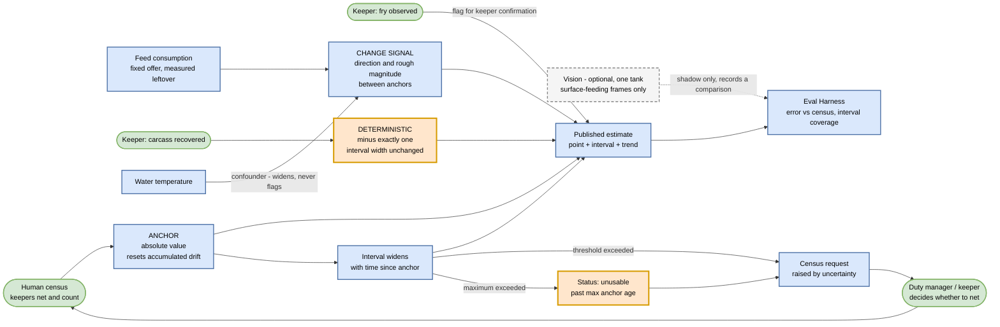

# Targeted AI view - jumping-piranha population (FR 2J)

Key: [00-legend.md](00-legend.md). Decision: [ADR-023](../adrs/ADR-023-anchor-piranha-population-on-human-census.md). Golden cases: [`evals/piranha-population/`](../evals/piranha-population/).

Counting the fish is the wrong goal. They occlude each other, netting them to check is stressful and hazardous, and nobody acts on the level anyway - they act on the change. So each signal does exactly one job, and the published answer is an interval, never a number.

## One job per signal

| Signal | Its job | Explicitly not its job |
|---|---|---|
| Human census | Anchor the absolute value, reset drift | Frequent monitoring |
| Feed consumption | Direction and rough magnitude of change | Producing a count, or flagging a loss on its own |
| Carcass recovered | Decrement by exactly one, deterministically | Being weighted against other evidence |
| Fry observed | Flag for keeper confirmation | Declaring that breeding has occurred |
| Water temperature | Widen the interval when it confounds intake | Explaining away a population change |
| Vision, if funded | A third opinion, in shadow | Any published figure |

## The loop that makes this work

**Confidence decays away from the anchor**, so the interval widens on its own. Past a threshold the system asks for a census; past the maximum it stops answering and publishes `unusable` rather than a number with a very wide band - because a wide interval still reads as an answer, while `unusable` reads as a request.

That closes a loop worth stating plainly: **measurement is scheduled by uncertainty, not by calendar habit.** Netting a tank of piranha costs the colony stress and the keepers safety, so it is spent only when it buys something.

## The honest gap

A piranha eaten by its tankmates leaves **no carcass**, and under a feed-to-appetite regime the tank still consumes the same total - fewer fish simply eat more each. Cannibalism is the most likely loss mode here and it is close to invisible.

That is why `feed` is drawn as *fixed offer, measured leftover*. The feeding protocol is part of the instrument. If keepers feed to appetite, per-capita intake is unobservable and the entire between-census signal collapses. This is a real operational constraint imposed on keepers by an architectural choice, and it needs their agreement before anything is installed.

## Verification

**Interval coverage is the metric that matters most.** If the published interval is nominally 90 percent, the census should land inside it close to 90 percent of the time across many anchors. Under-coverage means the system is overconfident, which is exactly what Appendix B rejects when it refuses "a single magic number". Over-coverage means the interval is too wide to inform anything. Coverage is measured across a season and cannot be asserted by a single golden case, so the cases defend the behaviours that make coverage possible instead.

Alongside it: absolute error against census, change-detection latency from a known loss to the flag, and census-request precision - how often a census the system asked for actually found a change.

## What this view does not show

Individual animal health, which is [ai-animal-health-anomaly](ai-animal-health-anomaly.md); where these components run, which is [c2](c2-containers-animal-care.md); and the census method itself, which is a veterinary and safety question left open in ADR-023.
