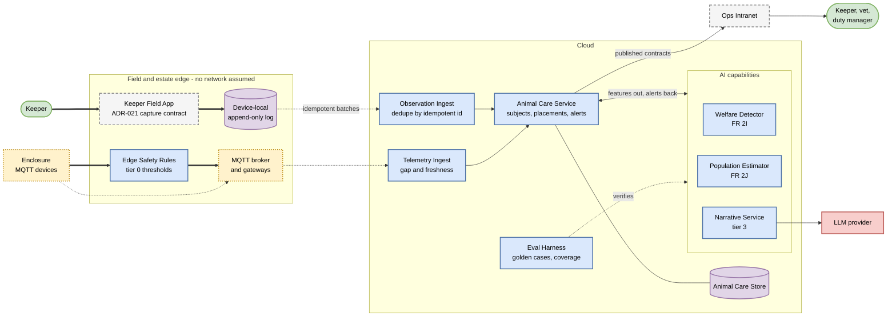

# Container view - animal care

Key: [00-legend.md](00-legend.md). Scope and ownership: [animal-care-scope.md](../docs/animal-care-scope.md).

This view answers one question: **what still works when the estate loses connectivity?** Thick arrows are the paths that survive an outage. Everything else can wait.

## How to read it

**The thick path is the architecture.** A keeper records an observation with no network, it lands durably on the device, and it syncs later. Separately, edge safety rules evaluate hard environment thresholds against sensor readings and raise an alert locally the moment a threshold is crossed. Neither path waits for the cloud. Detection and delivery are different concerns, and only delivery is allowed to be delayed by an outage.

**Everything in the cloud is asynchronous by design.** Nothing in animal care is a hot path in the sense ADR-002 uses for gate access - no guest is held at a barrier waiting for us.

**The vendor sits at the far edge of the picture, reachable only through the Narrative Service.** That placement is the whole of our exposure to a model provider changing price, behaviour, or disappearing. Delete the red box and welfare detection is unaffected; alerts simply lose their prose.

## What this view deliberately does not show

- **Staff screens.** The ops intranet is another workstream's container. We publish contracts to it and build no UI.
- **How the Keeper Field App is built.** The app is the intranet workstream's; ADR-021 only mandates the capture contract it must honour - local durability, idempotent ids, batch sync, deferred attachments.
- **Broker topology and gateway placement.** Drawn as one amber box because no workstream owns that decision. It is a seam, not a design.
- **Ticketing and popularity.** Enclosure checkpoint scans belong to ticketing ([ADR-002](../adrs/ADR-002-use-signed-static-QR-for-attraction-token-presentation.md)) and never touch animal care.
