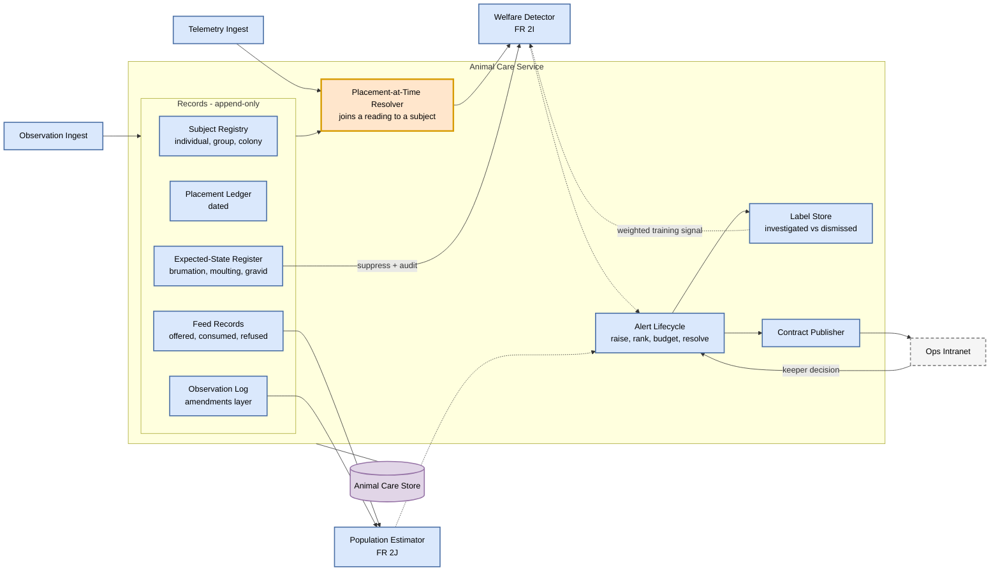

# Component view - inside the Animal Care Service

Key: [00-legend.md](00-legend.md). Zoom-in on the `Animal Care Service` container from [c2-containers-animal-care](c2-containers-animal-care.md).

This view exists to show two things that are easy to lose at container level: where the ADR-020 placement join actually happens, and where a keeper's decision becomes a training label.

Every component in `Animal Care Service` persists to the `Animal Care Store`; that is drawn as a single line to the service boundary rather than one arrow per component, which would bury the flow in a dozen crossing edges.

## How to read it

**The orange box is the risk.** `Placement-at-Time Resolver` is the join ADR-020 names as the primary cost of separating a subject from its enclosure. Get it wrong and environment readings from the wrong tank flow silently into a subject's features - a wrong answer that looks right. It is drawn as its own component, with a thicker border, because a risk that lives inside another component's implementation is a risk nobody tests.

**Follow the loop on the right.** An alert goes out to the intranet, a keeper accepts or rejects it, and that decision returns as a weighted training label. This is the mechanism ADR-022 relies on to eventually earn a tier 2 model. The ops tool and the training pipeline are the same artefact, which is why they are one loop on this diagram rather than two subsystems.

**`Expected-State Register` gates the detector, not the data.** A keeper declaring brumation suppresses scoring and writes an audit record. The underlying feed observations are still recorded - what happened is never erased, only its interpretation is suspended.

**Labels are not equal.** The `Label Store` distinguishes an investigated reject from a dismissed one, because a keeper who was too busy to look has not told you the animal is well. Treating those as the same label would teach a tier 2 model that busy days are healthy.

## What this view deliberately does not show

- Storage internals, table design, or API shapes. Those follow the data contract, which is not written yet.
- The edge safety rules, which run outside this container - see the container view.
- Retry, backoff, and dead-letter handling on ingest. Real, but noise at this level.
