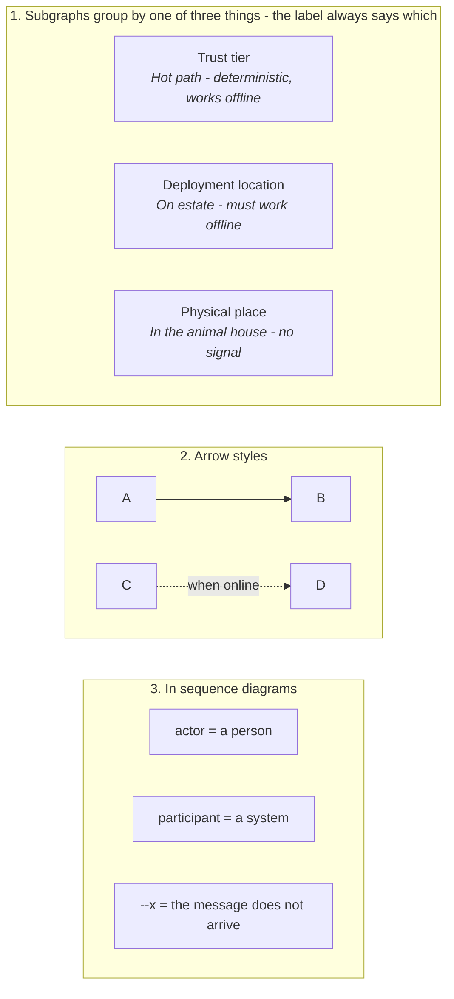

# Diagram key

Nineteen mermaid diagrams across this repository. They use a small, deliberately restricted vocabulary, and this page is the whole of it.

The governing rule is at the top because it is the one that matters:

> **Node shape carries no meaning. Every box is a rectangle.**
>
> Distinctions are carried by three things only: which subgraph a node sits in, which arrow style reaches it, and the label on that arrow. If two boxes look the same it is because nothing about their shapes was meant to tell you apart.

That is a choice, not an omission. A diagram that uses a cylinder for a datastore, a hexagon for a queue and a stadium for a service teaches the reader a private alphabet before it teaches them anything about the estate. This repository spends its symbolic budget on the distinction that actually decides the architecture: **what is allowed to fail.**

## The key

## 1. Subgraphs

A subgraph is a grouping box. **It means one of three things, and the subgraph's own label always tells you which** - there is no unlabelled subgraph anywhere in the repository.

| Meaning | Reads like | Where |
|:--|:--|:--|
| **Trust tier** - whether this path is allowed to fail | `Hot path - deterministic, works offline` `Async path - AI, advisory, may fail` `Edge snapshots - last known good, age visible` | [README](../README.md), [hld/README](../hld/README.md) |
| **Deployment location** - where the code runs | `Guest surfaces` `On estate - must work offline` `Cloud - core platform` `Cloud - analytics and AI, may fail` | [hld/core-func/2_Containers](../hld/core-func/2_Containers.md) |
| **Physical place** - where in the park you are standing | `In the animal house - no signal` `Cloud` | [hld/scenarios/animal-care](../hld/scenarios/animal-care/README.md) |

A fourth use is plain visual grouping with no semantic weight, and those labels are correspondingly plain: `Role-specific views`, `Sources - each with gap flags`.

The three-way overlap is deliberate rather than sloppy. **The trust tier and the deployment location are not the same distinction**, and conflating them is the mistake this architecture is built to avoid. Cloud code can be hot (it is not, here) and estate code can be advisory. The container diagram splits `Cloud - core platform` from `Cloud - analytics and AI, may fail` precisely because both run in the same region on the same account, and only one of them is allowed to be down.

## 2. Arrows

| Style | Meaning | Count |
|:--|:--|--:|
| `-->` | A solid dependency or data flow. Always present, always expected to work. | 131 |
| `-.->` | **A qualified edge. Always labelled.** The label says which of the three qualifications applies - see below. | 6 |
| `->>` | A message in a sequence diagram. Same weight as `-->`; the different glyph is mermaid's, not ours. | 75 |
| `--x` | In a sequence diagram: **the message is sent and does not arrive.** Used once, for a gateway bridging to a cloud that is not there. | 1 |

### The three things a dashed arrow can mean

Every dashed arrow in this repository carries a label, and the label disambiguates. This is the convention the rest of the key rests on, so it is worth being exact.

| The label says | It means | Example |
|:--|:--|:--|
| **A condition** | The edge exists only when the condition holds. Otherwise it is simply absent, and the source works without it. | `kiosk -.->|"when online"| tickets` |
| **A suppression** | The edge exists and carries data, but the data is deliberately withheld from the destination's normal consumers. | `model -.->|"no alert until promoted"| inbox` |
| **A fallback trigger** | An automatic transition to a degraded path, fired by a named monitor or gate. | `act -.->|"drift alarm"| fallback` `fc -.->|"coverage below threshold"| base` |

All three are forms of "this edge is not unconditional", which is why they share a glyph. They differ in who decides: the network decides the first, a promotion gate decides the second, a monitor decides the third.

**If you add a dashed arrow, label it.** An unlabelled `-.->` is a diagram bug, and it is the only rule here that a reviewer should reject a change for.

## 3. Sequence diagrams

| Declaration | Means |
|:--|:--|
| `actor` | **A person.** Guest, Keeper, Vet, Duty manager, Ride engineer, Commercial, the Countess. |
| `participant` | **A system, service, device or store.** Everything that is not a person. |
| `Note over` | A constraint, a timing bound, or the reason a step exists. Notes are where the interesting content usually is. |
| `alt` | A genuine branch in behaviour, most often online versus offline. |

The split matters more than it looks. Half the point of these diagrams is that **the human is in the loop**, so being able to see at a glance which lifelines are people is how a reader checks that [ADR-0005](../adrs/ADR-0005%20-%20Human-in-the-loop%20authority%20for%20estate%20AI.md)'s authority model is actually drawn and not just asserted. A sequence diagram for a safety-adjacent flow with no `actor` in it is a diagram worth questioning.

## 4. Diagram types

| Type | Used for | Count |
|:--|:--|--:|
| `flowchart` | Structure: what talks to what, and which tier it sits in. | 12 |
| `sequenceDiagram` | Behaviour over time, especially the offline and degraded cases. | 7 |

There is no C4 notation, no UML, and no deployment-diagram symbology. [hld/core-func/1_Context](../hld/core-func/1_Context.md) is a context diagram in spirit - one bolded box for the system under design, everything else an external - but it is drawn as a flowchart like the rest, so a reader never has to switch alphabets.

## What is deliberately not in the key

- **No colour.** Nothing in any diagram depends on colour to be understood. Fill and stroke are left to the renderer, which also means these diagrams survive being printed in black and white, pasted into a document, or read by someone who cannot distinguish red from green.
- **No line thickness.** Mermaid's `==>` is unused.
- **No shape vocabulary.** See the rule at the top.
- **No icons.**

The whole notation is three subgraph meanings, four arrow styles, and one shape. A reader who has read this page has read everything the diagrams can say.

Related: [README](../README.md), [hld/README](../hld/README.md) (diagram conventions in context), [requirements/6_Glossary](../requirements/6_Glossary.md) (what the words in the boxes mean).
