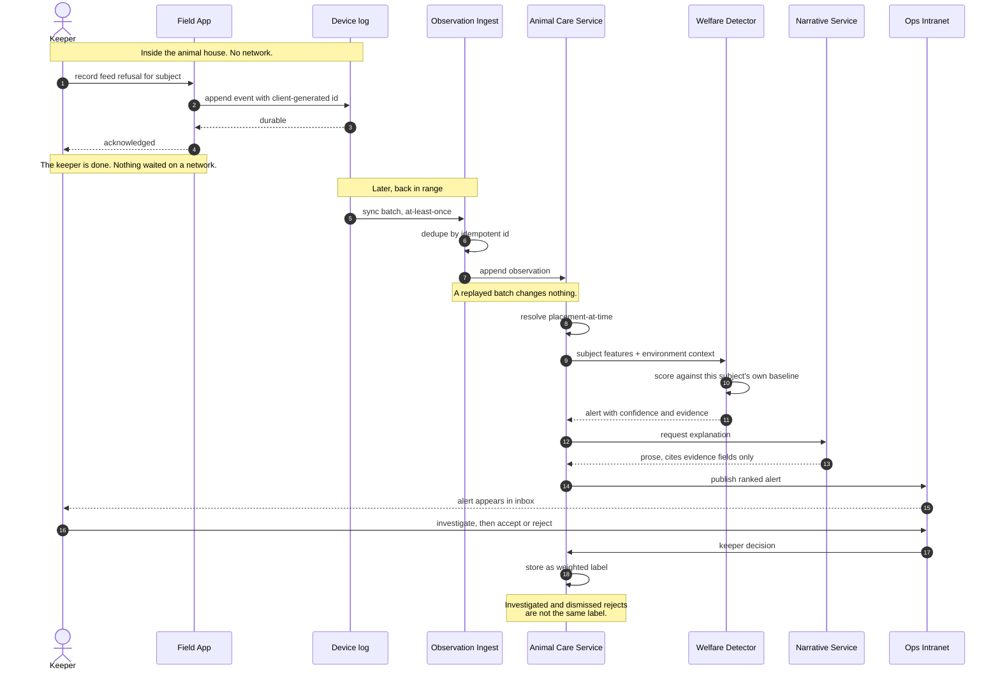

# Sequence - a keeper observation from a dead zone to a training label

Key: [00-legend.md](00-legend.md). Decisions: [ADR-021](../adrs/ADR-021-keep-keeper-observations-off-the-telemetry-path.md) for capture, [ADR-022](../adrs/ADR-022-detect-welfare-anomalies-against-per-subject-baselines.md) for detection.

This is the critical flow of the whole workstream. A keeper records a refusal inside an animal house with no signal, and the same act eventually becomes both a welfare alert and a labelled training example.

## Why it is drawn this way

**The keeper is released at step 4.** Acknowledgement happens against the device log, not against a server. Under ADR-021 the device is the durable first system of record, because a keeper standing in a dead zone cannot be asked to wait for a round-trip that will not complete.

**Step 6 is what makes step 5 safe.** Because every event carries a client-generated idempotent id, the sync protocol can retry as crudely as it likes without creating duplicate training labels. At-least-once delivery is the only guarantee that survives a patchy link, and deduplication on ingest is what makes it sufficient.

**Step 8 is the risky one.** Resolving placement-at-time is the cost ADR-020 accepts for separating a subject from its enclosure. If it resolves wrong, environment readings from a different enclosure enter the features silently and the answer looks plausible.

**The flow does not end at the alert.** Steps 16 to 18 are the reason this diagram exists: the keeper's decision returns as a weighted label. A single act of observation produces both an operational alert and a training example, which is how the tier ladder in ADR-022 ever reaches tier 2.

## What is not shown

- **The photo.** If the keeper attached one, it syncs separately and later. An alert is never held waiting for an attachment to cross a thin link, so the intranet renders "evidence pending" rather than "no evidence".
- **Suppression.** If the subject had a declared expected state, the detector would suppress at step 13 and write an audit record instead of raising.
- **The failure branch.** If the device is lost before step 6, the observation is gone. ADR-021 records that as a residual risk rather than claiming a mitigation closes it.
- **Tier 0.** Edge safety rules bypass this entire sequence and raise locally - see [c2](c2-containers-animal-care.md).
