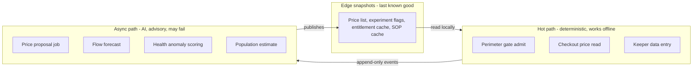

# High Level Design

This folder is the architecture itself. Requirements say what the estate needs; ADRs record what we decided and what it cost; this folder shows the result.

## How to read it

Start with the core platform. Every AI capability is an addition to it, and the question we hold ourselves to - do the architectural characteristics of the additions match the ones the platform already has? - only has an answer if the existing architecture is on the page first. `NFR_15` states it as a requirement: AI additions use the same identity, event backbone, and offline story as the rest of the estate, rather than arriving as a sidecar product.

| Folder | What is in it |
|:--|:--|
| [core-func/](core-func/README.md) | The estate platform: ticketing, perimeter gates, MQTT ingest, ops intranet, animal and ride records. The thing the AI sits on. |
| [scenarios/yield/](scenarios/yield/README.md) | Deep-dive 1 - async pricing, offline experiments, cohort analysis. Growth and profit. |
| [scenarios/popularity-flow/](scenarios/popularity-flow/README.md) | Deep-dive 2 - popularity from MQTT, congestion forecast, staffing advice. "Where do we invest and deploy staff?" |
| [scenarios/animal-care/](scenarios/animal-care/README.md) | Deep-dive 3 - health and feeding anomalies, piranha population. Welfare and cost. |
| [mlops/](mlops/README.md) | How a model gets promoted, evaluated, and rolled back. Makes the AI verifiable. |
| [data-structure/](data-structure/README.md) | The minimum records and events the platform must collect, per [Appendix A section 4](../requirements/Appendix%20A_%20Core%20functionality.md). |
| [sizing.md](sizing.md) | Devices, events/sec, gate lanes, gateway buffers and warehouse volumes, derived from the brief's figures rather than asserted. |
| [deployment.md](deployment.md) | Where every container runs, what is redundant, and how the topology meets the 4-hour RTO and 15-minute RPO in `NFR_2`. |

## The three deep-dives, and why only three

[Appendix C](../requirements/Appendix%20C_%20Future%20scope.md) names three AI themes to deep-dive rather than a dozen to mention. They map to the three things the Countess actually asked for: make the estate profitable, tell us what is popular, keep the animals healthy.

Ride predictive maintenance (FR#2K) and the ops copilot are real but treated as platform features with a named authority level, not as deep-dives. That is a deliberate choice about depth over breadth.

## Two architectural rules that run through everything

Every diagram in this folder obeys both. They are the reason the AI additions fit rather than sit alongside.

**1. Hot paths are deterministic and local. AI is async and advisory.**

Gate admit, entitlement check, and the price shown at checkout never call a model, never call the cloud, and never wait for a forecast. AI runs on a schedule, writes a snapshot or an alert, and the edge consumes the last good copy of it.

**2. A gap is unknown, never zero.**

A silent zone, a stale price list, or an expired population anchor is displayed as unknown. No capability in this folder is permitted to interpolate silence into a confident number.

The arrow that does not exist is the important one: nothing in `async` is ever called *by* `hot`.

## Conventions

- Diagrams are mermaid in markdown, so they diff in review and need no export step.
- **[diagrams/legend.md](../diagrams/legend.md) is the diagram key** and covers all 19 diagrams in the repository. The short version: node shape means nothing, every box is a rectangle, and the three things that do carry meaning are subgraph membership, arrow style, and the label on a dashed arrow.
- C4 levels: context (who and what), container (deployable pieces), plus a sequence per critical flow.
- Every container table cites the ADR that put it there. A box with no ADR is a box nobody decided on.
- Numbers in these documents are derived in [sizing.md](sizing.md) or priced in [cost-analysis](../cost-analysis/README.md). A figure that appears without one of those two behind it is a figure to challenge.
