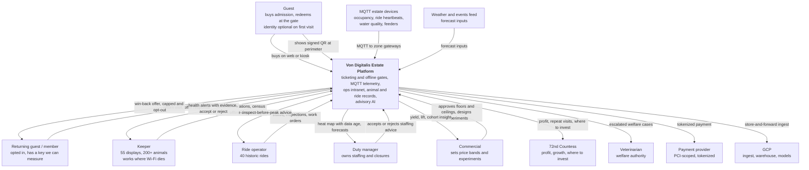

# C4 Level 1 - System Context

Who the estate platform serves, and what it depends on. One diagram, then what each relationship actually costs us.

## Actors

| Actor | What they need | Design consequence |
|:--|:--|:--|
| Guest | Buy admission including a family pass; get in | Identity optional on first visit (Appendix A 1-4); the gate must admit offline ([ADR-0002](../../adrs/ADR-0002%20-%20Signed%20QR%20entitlement%20at%20the%20perimeter%20gate.md)) |
| Returning guest / member | A reason to come back | Membership is the only key that closes the loyalty loop - which is why it is incentivized rather than required |
| Keeper | Record feed and health; be told early when something is wrong | Offline-first data entry (NFR_17); alerts advise and never act ([ADR-0005](../../adrs/ADR-0005%20-%20Human-in-the-loop%20authority%20for%20estate%20AI.md)) |
| Ride operator | Ride status, inspection evidence, work orders | Ride status is human-authored and deterministic; AI may draft a work order only |
| Duty manager | Know where the crowd is and where staff should be | Heat map shows data age; staffing advice is accept/reject with a volume cap |
| Commercial | Grow yield without wrecking guest trust | Price bands are human-approved; safety and welfare are denylisted from experiments |
| Countess | Profit, growth, and evidence for investment | Reporting is the warehouse view, not a live model call |
| Veterinarian | Welfare authority | Software escalates; it never decides |

## External dependencies

| Dependency | What breaks if it is gone | Our answer |
|:--|:--|:--|
| Payment provider | New purchases stop | Already-issued entitlements still admit - the gate holds no payment dependency |
| MQTT devices | Popularity and health telemetry stop | Affected zone publishes **unknown**, not zero ([ADR-0003](../../adrs/ADR-0003%20-%20MQTT%20gateways%20as%20the%20estate-to-cloud%20path.md)) |
| GCP | Analytics, reporting, and all AI stop | Gates, kiosks, and keeper apps keep working on last-known-good; ops sees an edge dashboard with a staleness banner ([ADR-0001](../../adrs/ADR-0001%20-%20GCP%20as%20the%20estate%20cloud%20platform.md)) |
| Weather and events feed | Forecast quality degrades | Forecast falls back to same-daypart-last-week ([ADR-0004](../../adrs/ADR-0004%20-%20Vertex%20AI%20behind%20a%20capability%20interface.md) fallback table) |

## What this diagram is claiming

Three things, and each is checkable.

**The estate has no single external dependency that can close it.** Payment, cloud, and network can each fail without stopping admission of already-sold entitlements. This is the NFR_2 commitment drawn as a picture.

**Every AI output in this diagram points at a human, not at an actuator.** There is no arrow from the platform to a ride, a lock, a barrier, or a feeder. That absence is [ADR-0005](../../adrs/ADR-0005%20-%20Human-in-the-loop%20authority%20for%20estate%20AI.md).

**The guest is allowed to stay anonymous.** Which is why the loyalty goal (OKR 3.1) depends on making membership attractive rather than on tracking, and why NFR_8 prefers counts over identification.

Next: [C4 Level 2 - Containers](2_Containers.md).
