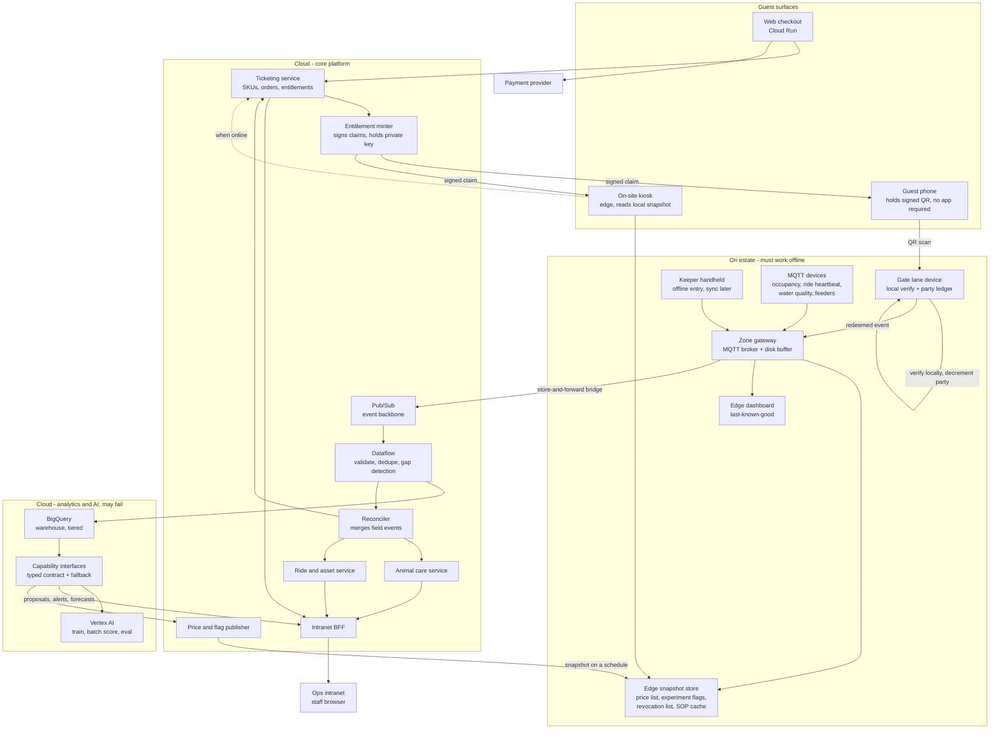

# C4 Level 2 - Containers

The deployable pieces, split by the only division that matters on this estate: **what must work when the network is gone**, and what may fail.

## Containers

### On estate - the offline tier

| Container | Responsibility | ADR |
|:--|:--|:--|
| **Gate lane device** | Scans the QR, verifies the signature against a pre-distributed public key, decrements the party ledger, admits or refuses. Holds the revocation list. Makes **no** network call to decide. | [ADR-0002](../../adrs/ADR-0002%20-%20Signed%20QR%20entitlement%20at%20the%20perimeter%20gate.md) |
| **Zone gateway** | Local MQTT broker plus disk-backed store-and-forward bridge. The unit of islanding. Classifies events (access, welfare, popularity) and sheds only popularity under pressure. Emits heartbeats so silence is detectable. | [ADR-0003](../../adrs/ADR-0003%20-%20MQTT%20gateways%20as%20the%20estate-to-cloud%20path.md) |
| **Keeper handheld** | Feed amounts, refusals, observations, census entries, carcass records. Writes append-only events to the local gateway; syncs when a link returns. Large targets, gloved use, full-shift battery. | [ADR-0021](../../adrs/ADR-0021%20-%20Keeper%20field%20events%20are%20append-only%20and%20offline-first.md) |
| **Edge snapshot store** | Last-known-good price list, experiment flag snapshot, revocation list, SOP cache. Pulled on a schedule; **never** fetched on demand during a guest interaction. Every entry carries its own age. | [ADR-0010](../../adrs/ADR-0010%20-%20Publish%20prices%20asynchronously%20inside%20approved%20bands.md), [ADR-0011](../../adrs/ADR-0011%20-%20Sticky%20offline%20experiment%20assignment.md) |
| **Edge dashboard** | Zone occupancy and open alerts from the local gateway when the cloud view is unreachable. Always labelled with data age. | [ADR-0003](../../adrs/ADR-0003%20-%20MQTT%20gateways%20as%20the%20estate-to-cloud%20path.md) |
| **On-site kiosk** | Purchase and reprint. Prices come from the snapshot. A dead phone is solved here. | [ADR-0002](../../adrs/ADR-0002%20-%20Signed%20QR%20entitlement%20at%20the%20perimeter%20gate.md) |

### Cloud - core platform

| Container | Responsibility | ADR |
|:--|:--|:--|
| **Ticketing service** | SKUs, orders, payment orchestration, entitlement lifecycle. System of record for what was sold. | [ADR-0001](../../adrs/ADR-0001%20-%20GCP%20as%20the%20estate%20cloud%20platform.md) |
| **Entitlement minter** | Signs the claim at purchase, where connectivity exists by definition. Holds the private key, which never reaches a guest device or a gate. | [ADR-0002](../../adrs/ADR-0002%20-%20Signed%20QR%20entitlement%20at%20the%20perimeter%20gate.md) |
| **Pub/Sub** | Event backbone. Absorbs reconnect backfill without shard planning. | [ADR-0001](../../adrs/ADR-0001%20-%20GCP%20as%20the%20estate%20cloud%20platform.md) |
| **Dataflow** | Validation, dedupe on `(device id, sequence)`, **gap detection**, enrichment, dead-letter. Where unknown gets created as a first-class value. | [ADR-0003](../../adrs/ADR-0003%20-%20MQTT%20gateways%20as%20the%20estate-to-cloud%20path.md) |
| **Reconciler** | Merges append-only field events into service state. Resolves offline redemptions and flags cross-gate over-admission. | [ADR-0002](../../adrs/ADR-0002%20-%20Signed%20QR%20entitlement%20at%20the%20perimeter%20gate.md) |
| **Animal care service** | Displays, species, enclosure environment, feed records, health notes, population, keeper alert inbox. | [ADR-0020](../../adrs/ADR-0020%20-%20Enclosure%20and%20colony%20as%20the%20care%20subject.md) |
| **Ride and asset service** | Ride identity and criticality, status (human-authored), inspections and due dates, work orders, incidents. | [ADR-0005](../../adrs/ADR-0005%20-%20Human-in-the-loop%20authority%20for%20estate%20AI.md) |
| **Price and flag publisher** | Turns an approved proposal into a snapshot the edge can pull. The only writer to the guest-facing price list. | [ADR-0010](../../adrs/ADR-0010%20-%20Publish%20prices%20asynchronously%20inside%20approved%20bands.md) |
| **Intranet BFF** | Composes the staff view over ticketing, telemetry, animal, and asset services. Owns no domain data of its own. | - |

### Cloud - analytics and AI

| Container | Responsibility | ADR |
|:--|:--|:--|
| **BigQuery** | Warehouse and feature source. Tiered hot 30d / warm 1y / cold 3y (NFR_9). | [ADR-0001](../../adrs/ADR-0001%20-%20GCP%20as%20the%20estate%20cloud%20platform.md) |
| **Capability interfaces** | One typed contract per AI capability, each with a provider adapter and an exercised fallback. Confidence, evidence, and freshness are mandatory on every response. Metering and kill switch live here. | [ADR-0004](../../adrs/ADR-0004%20-%20Vertex%20AI%20behind%20a%20capability%20interface.md) |
| **Vertex AI** | Training, batch scoring, evaluation. Reached only through a capability interface. | [ADR-0004](../../adrs/ADR-0004%20-%20Vertex%20AI%20behind%20a%20capability%20interface.md) |

## The arrows that are deliberately missing

A container diagram is as much about what does not connect. Each of these absences is a decision someone could otherwise undo by accident.

| Missing arrow | Why |
|:--|:--|
| Gate lane → cloud, for an admit decision | The admit path has no remote dependency. CI asserts the verification path makes no outbound call ([ADR-0002](../../adrs/ADR-0002%20-%20Signed%20QR%20entitlement%20at%20the%20perimeter%20gate.md)). |
| Checkout → capability interface | Prices are read from a published snapshot. A model is never on the checkout path (NFR_3, [ADR-0010](../../adrs/ADR-0010%20-%20Publish%20prices%20asynchronously%20inside%20approved%20bands.md)). |
| Capability interface → ride/asset status | AI may draft a work order. Ride status is human-authored (NFR_7, [ADR-0005](../../adrs/ADR-0005%20-%20Human-in-the-loop%20authority%20for%20estate%20AI.md)). |
| Capability interface → animal care state | Health scoring writes to an alert inbox. A keeper decision changes animal state, not a model. |
| MQTT gateway → guest phone | MQTT is the audit and popularity channel. It is not a wallet or a notification path. |
| Intranet BFF → its own domain database | The intranet is a view. Tickets stay in ticketing, telemetry in the event path - a named risk in [5_Risks and mitigation](../../requirements/5_Risks%20and%20mitigation.md). |

## Scaling to 15,000 visitors a day

| Pressure | Where it lands | Response |
|:--|:--|:--|
| Morning arrival peak | Gate lanes | Lane count, not software. Optical scan throughput is the stated ceiling in [ADR-0002](../../adrs/ADR-0002%20-%20Signed%20QR%20entitlement%20at%20the%20perimeter%20gate.md) and needs site design before the growth lands. |
| More devices per guest, more events per device | Zone gateways, Pub/Sub | Edge aggregation; Pub/Sub absorbs bursts; telemetry grows faster than visitor count (NFR_1 risk). |
| Backfill after an island reconnects | Dataflow, BigQuery | Idempotent consumers; restatable aggregates; drain time is a tracked metric. |
| Checkout concurrency | Cloud Run, ticketing | Horizontal; no model call in the path, so scaling is conventional. |
| Staff review volume | Keepers, duty manager | Attention budgets per role, capped by [ADR-0005](../../adrs/ADR-0005%20-%20Human-in-the-loop%20authority%20for%20estate%20AI.md). This is the ceiling that does **not** scale with cloud spend. |

The last row is the honest one. Everything else on this estate scales by spending money; human review does not, which is why authority levels are policy rather than configuration.

Next: [Gate redeem sequence](3_Gate_Redeem_Sequence.md) for the critical flow, or [container responsibilities overview](README.md).
