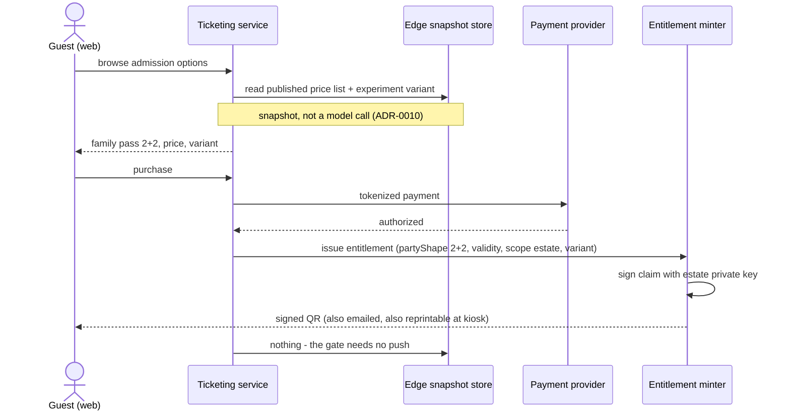
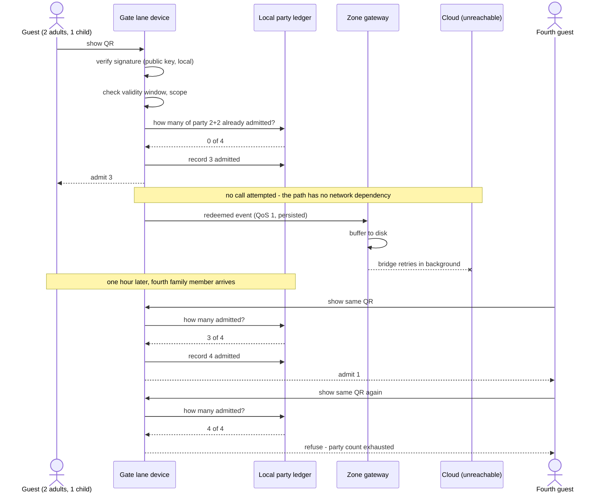
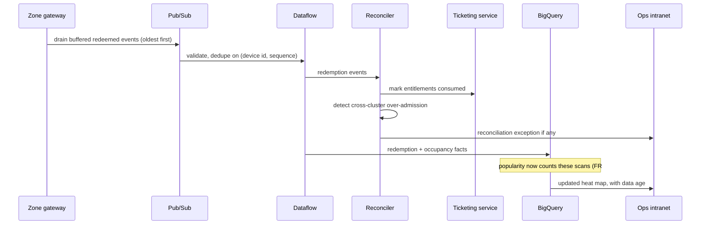

# Sequence - Buy, admit, reconcile

The estate's most critical flow. A family buys a pass at home, arrives in two groups, and gets in while the cloud link is down.

## Purchase - online by definition

Two things to notice. The price the guest sees came from a snapshot, so checkout does not depend on any AI being alive. And the claim is signed **here**, where connectivity is guaranteed because a payment just succeeded - which is why the gate never needs to mint anything.

## Admission - offline, partial party

The estate link is down. This is the normal case, not the exception.

The party ledger is the whole point. A family pass that could only be scanned once would be wrong about how families arrive at a park.

## Reconciliation - after the link returns

Access events are drained oldest-first and are never shed - that classification is [ADR-0003](../../adrs/ADR-0003%20-%20MQTT%20gateways%20as%20the%20estate-to-cloud%20path.md)'s guarantee. Popularity aggregates for the outage window are restated when the backfill lands, which is why "today's numbers" are provisional until buffers drain.

## Failure cases

| Case | Gate behaviour | Why |
|:--|:--|:--|
| Cloud down | Admit normally | No dependency in the path ([ADR-0002](../../adrs/ADR-0002%20-%20Signed%20QR%20entitlement%20at%20the%20perimeter%20gate.md)) |
| Zone gateway down | Admit normally; lane buffers locally | The ledger is on the lane, not the gateway |
| Lane device replaced mid-day | Party ledger restored from the cluster; if isolated, worst case is re-admitting one party | Bounded by party size |
| Tampered or forged QR | Refuse, distinct reason code | Signature verification is local and unforgeable |
| Expired or wrong-day pass | Refuse, distinct reason code | Validity window in the claim |
| Refunded pass, revocation not yet arrived | **Admits** | Accepted risk: revocation is eventually consistent, loss bounded at one admission |
| Two partitioned clusters, same pass | Both may admit up to the party count | Accepted and bounded; reconciler flags the pattern |
| Dead phone | Kiosk reprint, same artefact | Paper is a first-class presentation |
| Dirty lens or screen glare | Retry, then kiosk reprint | The realistic failure mode; an ops checklist, not a code path |

The refund row is the uncomfortable one, and it is stated rather than hidden. The alternative - checking revocation centrally at the gate - is the thing the whole record refuses.

## What this flow proves

- **Gate redeem never touches the cloud.** The NFR_2 commitment, drawn.
- **A price is read, never computed.** No model on the guest path (NFR_3).
- **Field writes are append-only; the cloud reconciles.** The Appendix A 2-6 conflict rule in action.
- **Popularity is a by-product of admission,** so the "what is popular?" question is answered by infrastructure the estate needed anyway.

Related: [ADR-0002](../../adrs/ADR-0002%20-%20Signed%20QR%20entitlement%20at%20the%20perimeter%20gate.md), [ADR-0003](../../adrs/ADR-0003%20-%20MQTT%20gateways%20as%20the%20estate-to-cloud%20path.md), [data structures](../data-structure/README.md).
