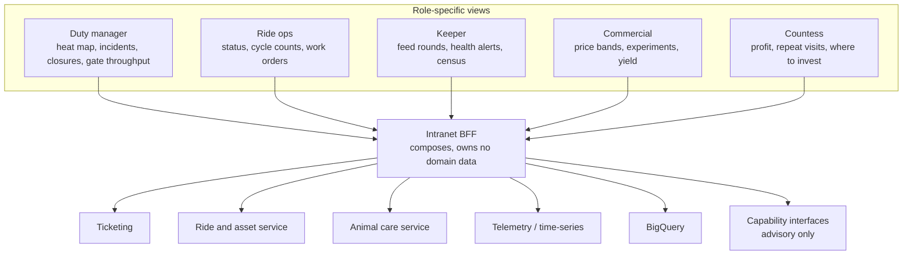
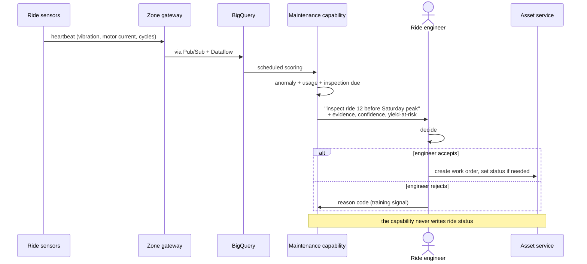

# Ride maintenance and the ops intranet

Two platform features that are not deep-dives but that the estate cannot open without: keeping 40 historic rides inspectable, and giving staff one place to see the estate.

Predictive maintenance (FR#2K) is treated here rather than as a fourth deep-dive. It is the same architectural pattern as animal health - telemetry, anomaly scoring, human decision - so giving it its own deep-dive would add length without adding an argument. What it does need is the yield connection, which is genuinely specific to this estate.

## The ops intranet is the estate operating system

Not a document portal, and **not** a system of record. It composes; it does not own ([Appendix A section 2](../../requirements/Appendix%20A_%20Core%20functionality.md)).

Putting tickets or the MQTT firehose in the intranet's own database is a named risk in [5_Risks and mitigation](../../requirements/5_Risks%20and%20mitigation.md). The BFF holds view state and nothing else.

### Every screen shows its age

A stale dashboard that looks live is worse than no dashboard, because staff will act on it. So:

- Each panel carries the age of its underlying data.
- A gapped zone renders as **unknown**, never as zero or as empty ([ADR-0003](../../adrs/ADR-0003%20-%20MQTT%20gateways%20as%20the%20estate-to-cloud%20path.md)).
- When the cloud view is unreachable, the duty manager falls back to the edge dashboard served from the zone gateway, banner and all.
- AI panels show confidence, evidence, and freshness because the capability contract requires them ([ADR-0004](../../adrs/ADR-0004%20-%20Vertex%20AI%20behind%20a%20capability%20interface.md)).

This is OKR 8.2: 100% of live ops screens show data age.

## Ride maintenance

40 rides from the 18th century, recently passed inspection after asbestos, broken glass, and garden gnomes were removed. Passing inspection is a starting point, not a finish line - the system's job is to keep producing evidence.

### What the platform records

| Record | Fields | Why |
|:--|:--|:--|
| Asset | Ride id, zone, criticality, heritage constraints | Criticality drives inspect-before-peak priority |
| Status | Open, closed, delayed, evacuated | **Human-authored always** (NFR_7) |
| Inspection | Who, when, checklist, next due | The audit trail that defends the estate |
| Work order | Fault, severity, parts, time to repair | Cost visibility for the Countess |
| Incident | Guest injury, near miss, animal escape | Cross-links to the animal module |
| Heartbeat | Vibration, motor current, gate sensors, e-stop, cycle count | Where fitted; feeds anomaly scoring |

### Predictive maintenance flow

Authority is **L2 Advise, capped** ([ADR-0005](../../adrs/ADR-0005%20-%20Human-in-the-loop%20authority%20for%20estate%20AI.md)). The model may draft a work order. It may not close a ride, and it may not return one to service - [Appendix C](../../requirements/Appendix%20C_%20Future%20scope.md) defers automatic return-to-service and this is why.

[ADR-0014](../../adrs/ADR-0014%20-%20Predictive%20ride%20maintenance%20in%20shadow%20behind%20the%20inspection%20schedule.md) adds the constraint that shapes everything else about this capability: **it may only ever pull an inspection forward, never push one back.** The statutory scheme of examination is a floor that runs whether this capability exists or not, which bounds the worst model failure at a wasted inspection rather than an uninspected ride.

### The estate-specific part: yield-at-risk

A generic predictive-maintenance system tells you a machine is degrading. On this estate the useful sentence is different, because the Countess's problem is *where to invest*:

> Ride 12 is showing bearing anomalies. It is in the top quartile for popularity, running at 180 guests/hour. Lost admission-attributable yield if it fails on Saturday: about X per hour.

That joins three things the estate was not previously joining at all - popularity ([ADR-0013](../../adrs/ADR-0013%20-%20Popularity%20and%20flow%20as%20advisory%20signals%20that%20degrade%20to%20unknown.md)), downtime, and maintenance cost. A pain point in [1_1 Business challenges](../../requirements/1_1_Business%20challenges.md) is exactly this: "a failed popular ride's lost yield is invisible".

It also sets the priority order honestly. A degrading unpopular ride is a maintenance ticket; a degrading popular ride is a revenue event.

### Why false-alarm rate is the first-class metric here

These are historic rides. Taking one out of service on a hunch is expensive, visible, and erodes engineer trust fast - and once engineers stop believing the alerts, the capability is worth less than nothing because it consumed attention on the way to being ignored.

So the eval pair is precision against missed failures, tracked from shadow onward, with the attention budget from [ADR-0005](../../adrs/ADR-0005%20-%20Human-in-the-loop%20authority%20for%20estate%20AI.md) applying: if the capability cannot stay inside the engineer's review budget, it retunes rather than asking for more of the engineer's day.

[ADR-0014](../../adrs/ADR-0014%20-%20Predictive%20ride%20maintenance%20in%20shadow%20behind%20the%20inspection%20schedule.md) puts numbers on that: a wasted inspection costs £340 and a fault the capability misses costs £1,500, a ratio of 4.4:1 that implies alerting at 22.7% confidence and a budget of **2 recommendations a day across 40 rides**. The ratio is small precisely because the statutory inspection catches what telemetry misses - which is why this capability alerts forty-one times more conservatively than animal health does on the same arithmetic.

## Staffing and tasking

Roster against predicted load, task assignment, and offline crew entry. The advisory half is the [popularity and flow deep-dive](../scenarios/popularity-flow/README.md); the platform half is task records, assignment, and completion - which also produce the data that tells us whether the advice was any good (OKR 4.3).

## Incidents

Guest-facing incident log - lost child, medical, animal-area breach - with time, zone, actions, and escalation to the duty manager.

Safety flows are scripted and deterministic. AI has no role here at all: not drafting, not prioritising, not summarising. Opening a previously private poisonous collection to the public creates liability that paper logs will not defend, and a generated summary in an incident record is a liability of its own.

Related: [containers](2_Containers.md), [ADR-0014](../../adrs/ADR-0014%20-%20Predictive%20ride%20maintenance%20in%20shadow%20behind%20the%20inspection%20schedule.md), [ADR-0005](../../adrs/ADR-0005%20-%20Human-in-the-loop%20authority%20for%20estate%20AI.md), [evals/ride-maintenance](../../evals/ride-maintenance/README.md), [data structures](../data-structure/README.md).
