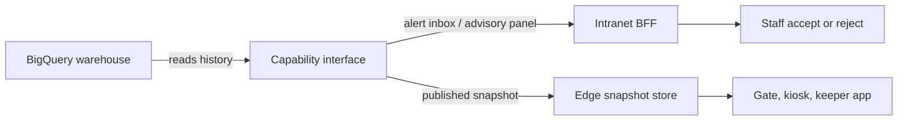

# Core Functionality - the estate platform

This is the platform the AI sits on. [Appendix C](../../requirements/Appendix%20C_%20Future%20scope.md) is explicit that ticketing, the intranet, and maintenance are **not deferred** - they are what makes the three AI deep-dives possible, and what the AI is judged for fitting.

## Read in this order

1. [C4 Level 1 - System Context](1_Context.md) - actors, external dependencies, and the arrows that deliberately do not exist
2. [C4 Level 2 - Containers](2_Containers.md) - the offline tier, the cloud core, and the AI tier
3. [Sequence - Buy, admit, reconcile](3_Gate_Redeem_Sequence.md) - the critical flow, including a partial family arrival during an outage
4. [Ride maintenance and the ops intranet](4_Maintenance_and_Intranet.md) - FR#2K and the staff surfaces
5. [Data structures](../data-structure/README.md) - the minimum records the platform must collect

## What the platform does

Grouped as [Appendix A](../../requirements/Appendix%20A_%20Core%20functionality.md) specifies them.

| Capability group | Contents | Where |
|:--|:--|:--|
| Guest | Buy admission and family passes, entitlements, perimeter gate access, optional membership, non-blocking on-estate aids, privacy rights | [ADR-0002](../../adrs/ADR-0002%20-%20Signed%20QR%20entitlement%20at%20the%20perimeter%20gate.md), [sequence](3_Gate_Redeem_Sequence.md) |
| Operations intranet | Duty-manager heat map, ride operations, asset and maintenance, animal care, staffing and tasking, incidents | [intranet](4_Maintenance_and_Intranet.md) |
| Commercial | Price list and experiment snapshots, family-pass configuration as data, popularity and yield reporting, returning-visitor loop | [yield deep-dive](../scenarios/yield/README.md) |

## The one design decision that shapes everything

**The estate is edge-first for anything a guest or keeper is standing in front of, and cloud-first for anything analytical.**

That is not a preference. Wi-Fi coverage is patchy and the animal houses are the worst of it, so a design that assumes connectivity at the point of interaction fails on a normal Tuesday.

| | Edge tier | Cloud tier |
|:--|:--|:--|
| Owns | Admit decisions, party ledger, price snapshot reads, keeper data entry | Orders, entitlement issue, reconciliation, warehouse, all AI |
| Availability target | Must work during multi-hour islanding (NFR_4) | RTO ≤4 hours for the ops view (NFR_2) |
| Consistency | Locally authoritative, eventually reconciled | Eventually consistent with the field, by design |
| Failure mode | Serves last-known-good, labelled with its age | Unavailable; the edge does not notice |

Everything else in this folder follows from that split.

## Container summary

Full responsibilities and ADR citations are in [2_Containers.md](2_Containers.md). In brief:

**On estate:** gate lane devices (local verify plus party ledger), zone gateways (MQTT broker plus disk buffer, the unit of islanding), keeper handhelds (offline append-only entry), edge snapshot store (price list, experiment flags, revocation list, SOP cache), edge dashboard, kiosks.

**Cloud core:** ticketing, entitlement minter (holds the signing key), Pub/Sub, Dataflow (dedupe and **gap detection**), reconciler, animal care service, ride and asset service, price and flag publisher, intranet BFF.

**Cloud AI:** BigQuery warehouse, capability interfaces (typed contract plus exercised fallback), Vertex AI.

## Data the platform must collect

Popularity, loyalty, and welfare questions are answerable from the platform **before** any model exists - which is also what gives the models something to train on. Minimum fields are in [Appendix A section 4](../../requirements/Appendix%20A_%20Core%20functionality.md) and sketched in [data-structure/](../data-structure/README.md).

The sequencing matters: phase 1 in [Appendix C](../../requirements/Appendix%20C_%20Future%20scope.md) ships ticketing, ingest, the heat map, and animal logs with **manually set prices**. The estate is useful and measurable before the first model is promoted.

## How the AI additions attach

Every deep-dive attaches at exactly two points, and never anywhere else:

Read from the warehouse; write to an inbox or a snapshot. No AI capability calls a core service synchronously, holds domain state, or sits on a guest-facing request path. That is the NFR_15 test - AI using the same event backbone, identity, and offline story as everything else - and it is checkable by looking for an arrow that should not be there.
