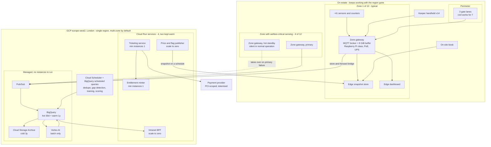

# Deployment view

Where every container from [2_Containers](core-func/2_Containers.md) physically runs, how many of each there are, what is redundant, and how the topology meets the 4-hour RTO and 15-minute RPO in `NFR_2`.

Counts come from [sizing](sizing.md). Costs come from [cost-analysis](../cost-analysis/README.md). Nothing here is a new decision; this page places decisions already made.

The organising fact, stated once:

> **A total loss of the cloud region is an analytics outage, not an estate outage.** Gates admit, checkout prices, keepers record, and welfare alarms fire, because none of those paths crosses the region boundary. That is what makes a single region and a 4-hour RTO a defensible choice for a three-person team rather than a corner cut.

## Topology

## Region

**`europe-west2`, London. Single region.**

| Question | Answer |
|:--|:--|
| Why London | The estate is British. [ADR-0001](../adrs/ADR-0001%20-%20GCP%20as%20the%20estate%20cloud%20platform.md) leaves the jurisdiction open and treats GDPR-class rights as the default bar, so the conservative choice is to keep guest data in-country until a jurisdiction record says otherwise. |
| What it costs | `europe-west2` is a **Tier 2** Cloud Run region; `europe-west1` (Belgium) is Tier 1 and Low CO2. The premium is roughly 25% of the Cloud Run line, so **about $6 a month**. |
| Verdict | Take the conservative choice. Six dollars is not a reason to have an argument about data residency later. |
| Revisit trigger | A jurisdiction ADR that permits `europe-west1`, or a carbon commitment that prefers it. At that point the move is a Terraform variable and a data copy, and it saves $6/month plus the Low CO2 designation. |

**Single region, not multi-region.** Three reasons, in order of weight:

1. **The estate does not stop.** A regional outage removes advice, reporting, and the cloud ops view. It does not remove admission, pricing, keeper recording, or welfare alarms - all of which are on the estate side of the boundary ([fitness-functions §1](../fitness-functions/README.md#1-availability)).
2. **`NFR_2` asks for 4 hours, not 4 minutes.** A multi-region active-active build meets a requirement nobody wrote.
3. **Three people.** Multi-region roughly doubles storage cost, adds replication lag as a failure mode, and adds a failover runbook that has to be rehearsed. [ADR-0001](../adrs/ADR-0001%20-%20GCP%20as%20the%20estate%20cloud%20platform.md) weighed six options against operability for a three-person team; this is the same criterion applied one level down.

Within the region, zonal redundancy is automatic and free: Cloud Run, Pub/Sub and BigQuery are regional services spanning zones by default. **The estate buys zone redundancy by choosing managed services, not by configuring it.**

## Where each container runs

### On estate

| Container | Count | Hardware | Redundancy |
|:--|--:|:--|:--|
| Sensors and counters | **487** | Vibration, motor current, cycle counters, e-stop beacons, approach and path counters, temperature, water quality, feed stations, weather | None individually. A dead device produces a gap marker and its zone reports unknown for it, never zero. |
| Zone gateway | **12 + 4** | Industrial single-board computer, PoE, 8 GiB eMMC buffer, UPS, weatherproof enclosure | One per zone, plus a **hot standby in the 4 zones carrying welfare-critical sensing** ([ADR-0003](../adrs/ADR-0003%20-%20MQTT%20gateways%20as%20the%20estate-to-cloud%20path.md)). Standby units publish nothing while the primary is healthy, so they add hardware without adding messages. |
| Gate lane device | **6**, in 3 lanes | Scanner plus lane controller per lane; local party ledger, cached public key, revocation list | N+1 by lane. Any lane admits any guest, so losing one costs throughput and not availability ([sizing §3](sizing.md#3-gate-lane-count)). |
| Keeper handheld | **14** | Rugged, gloved use, full-shift battery (`NFR_17`) | Pooled. A failed handheld is swapped; events are append-only, so nothing in flight is lost ([ADR-0021](../adrs/ADR-0021%20-%20Keeper%20field%20events%20are%20append-only%20and%20offline-first.md)). |
| Duty-manager tablet | **8** | Reads the edge dashboard | Pooled. |
| Edge snapshot store | 1 per zone | On the gateway | The snapshot is a file. A lost copy is re-pulled; a stale copy still works and says how stale it is. |
| Edge dashboard | 1 per zone | Served by the gateway | Degrades to the zone it can see, labelled with data age. |
| On-site kiosk | 2 | Reads the local snapshot | Two, because a kiosk is the answer to a dead phone, and having one of those is worse than having none. |

**527 devices at launch against the 535 in [sizing](sizing.md#1-device-count)**, and the eight-device difference is the whole growth story in one line: sizing counts gate hardware for all seven lanes, and only three are built. **Every other device in the estate is already there on day one**, because rides and enclosures do not multiply when visitors do. The four standby gateways are procurement, not telemetry, so they sit outside both totals.

**Which four zones get a standby gateway** is the remaining open question from [ADR-0003](../adrs/ADR-0003%20-%20MQTT%20gateways%20as%20the%20estate-to-cloud%20path.md), and it resolves to the zones containing the 18 aquatic enclosures and the poisonous collection - the subjects where a blind hour is a welfare event rather than a reporting gap. It needs the site survey and the vet.

### In the region

| Container | Runs on | Instances | Why |
|:--|:--|:--|:--|
| Ticketing service | Cloud Run | **min 1**, autoscaling | A cold start blows the 5 s p95 checkout in `NFR_3`. The warm instance costs $6.48/month and is the one place the architecture buys latency with money. |
| Entitlement minter | Cloud Run | **min 1**, autoscaling | Same reason, plus it holds the signing private key, so it is deliberately a small, separately deployable, separately audited service. |
| Intranet BFF | Cloud Run | scale to zero | Staff tolerate a cold start; guests do not. |
| Price and flag publisher | Cloud Run | scale to zero | Scheduled. Nobody is waiting. |
| Pub/Sub | Managed | - | Absorbs a 12-zone backfill without capacity planning ([sizing §5](sizing.md#5-backfill-drain)). |
| BigQuery | Managed | - | Hot 30 days and warm 1 year. No idle cost, which is why [ADR-0001](../adrs/ADR-0001%20-%20GCP%20as%20the%20estate%20cloud%20platform.md) chose it. |
| Cloud Storage | Managed, Archive class | - | Cold 3 years, 143 GiB, $0.17/month. |
| Vertex AI | Managed, **batch only** | - | No always-on inference endpoint exists. There is nothing to scale and nothing to leave running. |
| Dedupe, gap detection, training, scoring | Cloud Scheduler + BigQuery scheduled queries | - | See below. |

**There is no always-on streaming pipeline in this topology, and that is the single largest deployment decision on this page.** [2_Containers](core-func/2_Containers.md) draws Dataflow between Pub/Sub and BigQuery. Priced, a 24/7 streaming worker costs $316/month to process 17.6 messages a second - more than four times the entire rest of the platform. [cost-analysis §1](../cost-analysis/README.md#the-streaming-pipeline-is-the-single-largest-line-and-it-should-not-be) works through the alternative: a Pub/Sub BigQuery subscription lands the data with no compute, dedupe becomes an hourly `MERGE`, and gap detection becomes a scheduled query every five minutes. Total $1.43/month.

The latency cost is real and survives inspection: gap markers appear within five minutes rather than within seconds. Nothing depends on that. **Welfare alarms are deterministic rules at the gateway, not in the cloud** ([ADR-0022](../adrs/ADR-0022%20-%20Shadow%20before%20promote%20for%20animal%20health%20anomaly%20detection.md)), so the 60-second target in `NFR_3` is met on the estate side, three network hops before this pipeline exists.

Dataflow remains in the architecture as a batch tool, and the day a consumer genuinely needs cloud-side detection inside a minute, the streaming job comes back and costs what it costs.

## Environments

| Environment | GCP project | Purpose |
|:--|:--|:--|
| Production | `vde-prod` | The estate. |
| Staging | `vde-staging` | Where a budget alert fires before it matters ([ADR-0001](../adrs/ADR-0001%20-%20GCP%20as%20the%20estate%20cloud%20platform.md) ops check), where the kill switch is exercised per capability, and where the annual swap drill runs. |

Two projects, not three. A third gives a three-person team a third thing to keep in sync, and the gap it would fill - integration testing - is filled better by the eval suite running against staging.

Infrastructure is Terraform; services are container images in Artifact Registry deployed as Cloud Run revisions with traffic splitting. **Gateway firmware rolls out one zone at a time**, because a bad firmware push to 16 gateways at once is the only change in this system that could blind the entire estate simultaneously - and unlike a bad Cloud Run revision, it cannot be rolled back from a laptop.

## Meeting the RPO

`NFR_2`: **cloud analytics RPO ≤15 minutes under normal MQTT flow.**

| Data | Originates | What a total region loss costs |
|:--|:--|:--|
| Telemetry, welfare, access events | On estate | **Nothing.** Gateways hold 72 hours of buffer and replay on reconnect ([sizing §4](sizing.md#4-gateway-disk-buffer-and-the-islanding-slo)). The data is not lost, it is late. |
| Keeper field events | On estate | **Nothing.** Append-only, buffered, replayed ([ADR-0021](../adrs/ADR-0021%20-%20Keeper%20field%20events%20are%20append-only%20and%20offline-first.md)). |
| Gate redemptions | On estate | **Nothing.** The lane decided locally and holds the event ([ADR-0002](../adrs/ADR-0002%20-%20Signed%20QR%20entitlement%20at%20the%20perimeter%20gate.md)). |
| Orders and payments | In the cloud | Bounded by the ticketing store's point-in-time recovery window. This is the **only** RPO that is genuinely a database question. |
| Warehouse and model artefacts | In the cloud | Recomputable from replayed events and versioned SQL. |

Under healthy links, ingest lag is ≤30 seconds (`NFR_3`), so the measured RPO is around **30 seconds against a 15-minute target**. The interesting result is structural rather than numerical: **the store-and-forward design that exists to survive patchy Wi-Fi also turns most of the estate's RPO into zero**, because a buffer that survives a dead radio equally survives a dead region. One mechanism, two requirements, and only one of them was the reason it was built.

## Meeting the RTO

`NFR_2`: **RTO for the ops intranet cloud view ≤4 hours, with last-known-good edge dashboards in the meantime.**

Recovery into a second region:

| Step | Time | Note |
|:--|--:|:--|
| Declare, and point Terraform at `europe-west1` | 30 min | Human decision time dominates |
| `terraform apply`: Pub/Sub, buckets, service accounts, schedulers | 15 min | Nothing to provision that is not declarative |
| Deploy 4 Cloud Run revisions from Artifact Registry | 10 min | Images are regional-agnostic |
| Restore the ticketing store from backup | 30 min | The one stateful component |
| Copy the BigQuery hot and warm tiers, 51 GiB | 20 min | [sizing §6](sizing.md#6-warehouse-volume-per-retention-tier). Cold tier is not needed to restore service |
| Repoint 16 gateway bridges | 15 min | Configuration push; buffers drain afterwards |
| Gateway backfill drains | 83 min | [sizing §5](sizing.md#5-backfill-drain). The intranet is **usable** before this completes; it is complete when the numbers stop moving |
| **Total** | **≈3h 20m** | Against a 4-hour target |

Two honest caveats. The dominant term is human decision time, not technology - which means the RTO is met by having a runbook and someone empowered to use it, not by having smaller data. And the 51 GiB copy is fast **because the estate's whole warehouse is small** (195 GiB across all three tiers); a data platform sized for a problem this estate does not have would break this table before anything else did.

**Throughout those 3 hours 20 minutes, the estate is open.** Gates admit against cached public keys, checkout serves the last published price snapshot, keepers record to their local gateway, the edge dashboard shows what its zone can see with an honest age label, and welfare rules alarm as normal. What staff lose is the estate-wide view and all AI advice - which is precisely the set of things [ADR-0005](../adrs/ADR-0005%20-%20Human-in-the-loop%20authority%20for%20estate%20AI.md) declared advisory.

## Failure modes and who notices

| Failure | Blast radius | Detected by | Estate impact |
|:--|:--|:--|:--|
| One MQTT device | One reading | Missed publish interval, gap marker | Zone reports unknown for that sensor |
| One zone gateway, non-welfare zone | One zone blind | Missing heartbeat | Duty-manager view shows unknown for that zone, not empty |
| One zone gateway, welfare zone | None | Missing heartbeat | Hot standby takes over |
| Zone uplink | One zone islanded, up to 72 h | Gateway lag metric | None visible to guests; data arrives late |
| Estate WAN | All 12 zones islanded | Ingest lag, bridge errors | None visible to guests; 83-minute drain on recovery |
| One gate lane | One lane of 3 | Lane heartbeat | Throughput falls by a third; no guest is refused |
| Cloud Run service | One service | Health checks, error rate | Checkout unavailable if ticketing; **the gate is unaffected** |
| Model provider | All AI advice | Capability interface errors, drift monitor | Every capability serves its fallback ([uncertainty](mlops/uncertainty.md)) |
| GCP zone | None | Google's problem | None; managed services are multi-zone |
| **GCP region** | All cloud | Everything at once | Analytics, reporting and advice down for ≈3h 20m. **Admission, pricing, keeper recording and welfare alarms continue.** |

Reading the last column down is the point of the whole architecture. **There is no single failure in this table that closes the estate**, and the reason is that every row of guest-critical behaviour was deliberately placed above the region boundary rather than inside it.

Related: [2_Containers](core-func/2_Containers.md) (what each container does), [sizing](sizing.md) (every count on this page), [cost-analysis](../cost-analysis/README.md), [fitness-functions](../fitness-functions/README.md) (the availability arithmetic), [ADR-0001](../adrs/ADR-0001%20-%20GCP%20as%20the%20estate%20cloud%20platform.md), [ADR-0003](../adrs/ADR-0003%20-%20MQTT%20gateways%20as%20the%20estate-to-cloud%20path.md), [3_NFRs](../requirements/3_NFRs.md).
