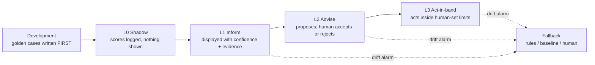

# MLOps - how a capability earns the right to be believed

The judges ask for "validation and verification of AI results" and for "dealing with uncertainty in the world of AI technology". This folder is the answer to both, and it is deliberately unglamorous.

The briefing's three uncertainty questions - what if the best model today is not the best tomorrow, what if the provider changes prices, what if the provider shuts down - are answered directly in **[uncertainty.md](uncertainty.md)**. The two capabilities that put text rather than numbers through a model are assessed against the OWASP LLM Top 10 in **[llm-security.md](llm-security.md)**. This page covers the rest: how a capability earns the right to be believed in the first place.

The bar from NFR_13: every production AI capability has golden cases in [`evals/`](../../evals/), a documented metric, shadow mode before it can act, and a fallback. *We can show the AI is working and detect when it starts misbehaving.*

## The promotion pipeline

No capability skips a stage. The authority ceiling for each is policy, set in [ADR-0005](../../adrs/ADR-0005%20-%20Human-in-the-loop%20authority%20for%20estate%20AI.md).

### Gates between stages

| Transition | Required evidence |
|:--|:--|
| Development → Shadow | Golden cases exist and pass; capability interface and **fallback implemented** ([ADR-0004](../../adrs/ADR-0004%20-%20Vertex%20AI%20behind%20a%20capability%20interface.md)) |
| Shadow → Inform | Minimum shadow duration; beats its named baseline; metric documented |
| Inform → Advise | Precision at operating threshold measured; **alert volume inside the role's attention budget** |
| Advise → Act-in-band | Human-set bounds exist and are enforced in code; kill switch tested; holdout retained |

The volume gate is the one that gets skipped elsewhere and matters most here. A capability that cannot stay inside a keeper's or duty manager's attention budget is not ready, however good its offline metrics look, because an inbox nobody reads has negative value.

## Golden cases come first

Written before the model, not after. They are the specification of what "working" means, and several encode a *refusal* rather than an accuracy target:

| Capability | A case that must pass |
|:--|:--|
| Pricing | A proposal above the ceiling is clamped; violations are zero |
| Experiments | A safety-adjacent factor fails to register |
| Cohorts | An inferred attribute cannot be persisted to a guest record |
| Flow forecast | Low coverage suppresses the forecast rather than degrading it |
| Animal health | A shadow model produces no keeper-visible alert |
| Piranha population | An estimate without an interval is rejected |

That last group is what makes this verifiable rather than aspirational. "The model is 87% accurate" is a claim; "the pipeline rejects a population estimate published without an interval" is a test that fails loudly.

## Four things monitored continuously

**Drift on golden cases.** Scheduled runs, not just at deploy. A provider can change behaviour under a pinned version, and this is how we find out ([ADR-0004](../../adrs/ADR-0004%20-%20Vertex%20AI%20behind%20a%20capability%20interface.md)).

**Accept rate.** For every L2 capability. It moves before offline metrics do, because keepers and duty managers notice degradation before a monthly report does. Worth noting both directions are bad: a collapsing accept rate means the model has drifted, and an accept rate near 100% with no rejections means nobody is reading.

**Input freshness and coverage.** A model fed stale or gapped data produces confident nonsense. Coverage is a first-class input signal, not a data-engineering detail ([ADR-0003](../../adrs/ADR-0003%20-%20MQTT%20gateways%20as%20the%20estate-to-cloud%20path.md), [ADR-0013](../../adrs/ADR-0013%20-%20Popularity%20and%20flow%20as%20advisory%20signals%20that%20degrade%20to%20unknown.md)).

**Cost per capability.** Metered at the interface, with a budget and a kill switch that drops to fallback rather than taking the consumer down (NFR_12).

## Uncertainty: pinning, swapping, and demotion

| Practice | Why |
|:--|:--|
| Versions pinned; no auto-upgrade on safety-adjacent paths | A provider release note is not a promotion decision (NFR_7) |
| Model version recorded on every output | Any past decision traces to the thing that produced it |
| **Annual swap drill** on a designated capability | Proves the two-week target in NFR_14 by doing it, not asserting it |
| Fallback exercised on a schedule | A fallback that has never run is a hypothesis |
| Automatic demotion on a drift alarm | Degradation is a mode, not an outage |

The swap drill is the part most architectures omit. NFR_14 targets swapping a provider for one capability in under two weeks; the flow forecast is the natural subject, being ours and the least safety-adjacent.

## Promotion is per subject type, where that matters

[ADR-0022](../../adrs/ADR-0022%20-%20Shadow%20before%20promote%20for%20animal%20health%20anomaly%20detection.md) promotes animal health **per subject type**, not per capability. A model may beat keeper rules for daily-feeding colonies and never beat them for a fortnightly-feeding python, where each observation is two weeks apart.

Uneven coverage is the correct outcome. Uniform promotion would mean trusting a model somewhere it has no evidence.

## Human feedback is the training set

Accept and reject with reason codes are labels, and for animal health they are the *only* labels that will ever exist ([ADR-0021](../../adrs/ADR-0021%20-%20Keeper%20field%20events%20are%20append-only%20and%20offline-first.md)). This is also why the reason-code taxonomy is an open question with keepers rather than a schema we invent: "rejected: other" teaches nothing.

Golden review subsets are re-scored when a version changes, and injected golden cases confirm reviewers are still discriminating rather than accepting by reflex.

## Cold start, stated plainly

Four of the [seven capabilities](../../adrs/ADR-0004%20-%20Vertex%20AI%20behind%20a%20capability%20interface.md#the-canonical-inventory) launch with **no history at all**. No conversion data, no occupancy history, no animal health labels, no fish counts. A fifth, ride maintenance, launches with sensors but no labelled failures ([ADR-0014](../../adrs/ADR-0014%20-%20Predictive%20ride%20maintenance%20in%20shadow%20behind%20the%20inspection%20schedule.md)); only the copilot has its corpus on day one.

| Capability | Day-one implementation | What the model waits for |
|:--|:--|:--|
| Pricing | Manual prices through the real pipeline | Conversion history |
| Flow forecast | Recency baseline | A season of occupancy |
| Animal health | Keeper-authored rules | Labelled events from those rules |
| Piranha population | Census anchor plus deterministic events | Calibration against several censuses |

The pattern is the same each time: **ship the pipeline with a human or a rule in the model's place.** The estate is useful and measurable in phase 1, and phase 1 manufactures the training data phase 2 needs. Anything else means either waiting a year to launch or promoting a model trained on nothing.

Related: [uncertainty](uncertainty.md), [llm-security](llm-security.md), [ADR-0004](../../adrs/ADR-0004%20-%20Vertex%20AI%20behind%20a%20capability%20interface.md), [ADR-0005](../../adrs/ADR-0005%20-%20Human-in-the-loop%20authority%20for%20estate%20AI.md), [`evals/`](../../evals/), [Appendix B](../../requirements/Appendix%20B_%20AI%20scenarios%20explained.md).
