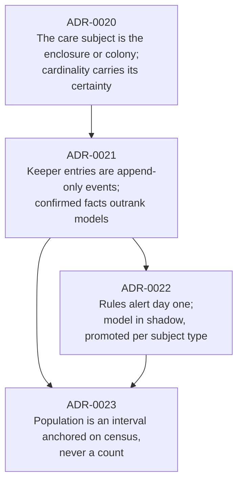
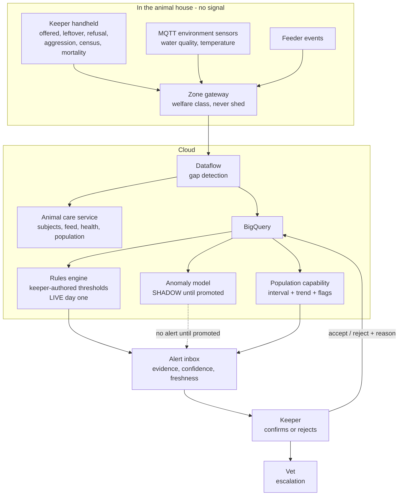
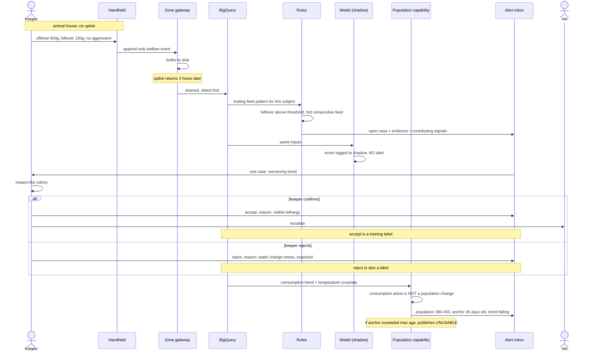

# Deep-dive 3 - Animal health, feeding, and population

**The business question:** "Looking after the animals is costly, even more so if they get sick! So we want healthy and happy animals" - plus, for the jumping piranha, "we also need to check population levels".

200+ animals, 55 displays, aquatic and land-based, poisonous, and newly open to the public. The building the keeper is standing in has no Wi-Fi.

## The chain of four decisions

This deep-dive is four ADRs because each one makes the next possible, and skipping any of them breaks the last.

[ADR-0020](../../../adrs/ADR-0020%20-%20Enclosure%20and%20colony%20as%20the%20care%20subject.md) gives cardinality somewhere to be uncertain. [ADR-0021](../../../adrs/ADR-0021%20-%20Keeper%20field%20events%20are%20append-only%20and%20offline-first.md) makes a keeper-confirmed carcass unarguable. [ADR-0022](../../../adrs/ADR-0022%20-%20Shadow%20before%20promote%20for%20animal%20health%20anomaly%20detection.md) establishes shadow-before-promote. [ADR-0023](../../../adrs/ADR-0023%20-%20Anchor%20aquatic%20population%20on%20human%20census.md) uses all three to publish an interval instead of a magic number.

## Container view

| Container | Responsibility | ADR |
|:--|:--|:--|
| **Keeper handheld** | Offline append-only entry. Offered **and** leftover as separate fields. Census and mortality as confirmed facts. | [ADR-0021](../../../adrs/ADR-0021%20-%20Keeper%20field%20events%20are%20append-only%20and%20offline-first.md) |
| **Environment sensors** | Water quality, temperature per enclosure. Welfare class - never shed under buffer pressure. | [ADR-0003](../../../adrs/ADR-0003%20-%20MQTT%20gateways%20as%20the%20estate-to-cloud%20path.md) |
| **Animal care service** | Care subjects with cardinality certainty, feed records, health notes, population, alert inbox. | [ADR-0020](../../../adrs/ADR-0020%20-%20Enclosure%20and%20colony%20as%20the%20care%20subject.md) |
| **Rules engine** | Keeper-authored thresholds per subject. Live from day one and the permanent fallback. | [ADR-0022](../../../adrs/ADR-0022%20-%20Shadow%20before%20promote%20for%20animal%20health%20anomaly%20detection.md) |
| **Anomaly model** | Scores the same inputs in shadow. Promoted per subject type only on evidence. | [ADR-0022](../../../adrs/ADR-0022%20-%20Shadow%20before%20promote%20for%20animal%20health%20anomaly%20detection.md) |
| **Population capability** | Interval anchored on census, feed-derived change tracking, deterministic decrements. Refuses to publish past maximum anchor age. | [ADR-0023](../../../adrs/ADR-0023%20-%20Anchor%20aquatic%20population%20on%20human%20census.md) |
| **Alert inbox** | One open case per subject, evidence and confidence shown, accept/reject with reason. Volume capped. | [ADR-0005](../../../adrs/ADR-0005%20-%20Human-in-the-loop%20authority%20for%20estate%20AI.md) |

## Flow - a colony eating less

Two moments matter. The model scores and stays silent - that is shadow mode, not a bug. And the population capability refuses to convert a consumption drop into a population claim, because temperature and season move intake too.

## The piranha problem, stated honestly

The brief asks to "check population levels" on a colony that cannot be counted from outside. [ADR-0023](../../../adrs/ADR-0023%20-%20Anchor%20aquatic%20population%20on%20human%20census.md) works through why, and the architecture that falls out is unusual enough to be worth restating:

| Signal | Job | Not its job |
|:--|:--|:--|
| Human census | Anchor the absolute value, reset drift | Frequent monitoring |
| Feed consumption | Direction and rough magnitude of change | Producing a count |
| Keeper observation | Deterministic events - a carcass, an observed fry | Inference |
| Vision (optional, one tank) | Third estimator, shadow first | Sole basis for any figure |

**The interval widens with time since the last census**, so the system asks for ground truth when it needs it. Census becomes uncertainty-driven rather than calendar-driven, which matters because netting a tank of piranha is hazardous for keepers and stressful for the colony.

And the uncomfortable part, which the ADR states rather than hides: **cannibalism is nearly invisible**. No carcass, and under feed-to-appetite the tank consumes the same total - fewer fish just eat more each. The only fix is an operational one, a fixed offered amount with measured leftover, which is an architectural decision imposing work on keepers. It needs their agreement before instrumentation, and if they refuse, the between-census signal collapses and [ADR-0023](../../../adrs/ADR-0023%20-%20Anchor%20aquatic%20population%20on%20human%20census.md) must be revisited rather than quietly degraded.

## Why rules come before the model

There are **no labels**. Nobody has recorded this collection's feeding behaviour in a structured way, so there is no notion of normal and no examples of illness. On top of that, a fortnightly-feeding python and a daily-feeding colony are different distributions, so one model across 55 displays would learn an average of incompatible behaviours.

| Phase | Health detection | Population |
|:--|:--|:--|
| 1 | Keeper-authored rules, live. Structured feed and observation capture. | Census entries, deterministic decrements |
| 2 | Model in shadow; recall and volume compared against rules per subject type | Feed-derived interval, calibrated against census |
| 3 | Promotion where earned; some subject types stay on rules permanently | Optional vision in shadow, one tank, cost-capped |

Partial promotion is the expected end state, not a failure. A model that never beats rules for a fortnightly feeder should never be promoted there.

## Verification

Golden cases in [`evals/animal-health/`](../../../evals/animal-health/) and [`evals/piranha-population/`](../../../evals/piranha-population/).

| What | Metric | Target |
|:--|:--|:--|
| Detection | Recall against keeper-labelled events | Materially faster than paper rounds (OKR 5.1) |
| Trust | Alert volume per keeper per shift | Within attention budget |
| Honesty | Population estimate published without an interval | **0** |
| Calibration | Interval coverage against census | Close to nominal - under-coverage means overconfident |
| Determinism | Carcass decrements by exactly one | Always |
| Refusal | Estimate past max anchor age | Published as unusable, never as a number |
| Shadow discipline | Shadow model alters a published figure | **0** |
| Confounding | Consumption change alone raises a population flag | **0** |

Interval coverage is the metric worth defending in front of judges. A bare "417 fish" cannot be wrong in any measurable way; an interval that should contain the census 90% of the time and contains it 60% of the time is demonstrably broken.

## What this deep-dive does not do

- No autonomous welfare action - no auto-medicate, no auto-cull, no auto-resolve, at any confidence, ever.
- No individual identification of fish.
- No vision by default (optional, one tank, shadow, cost-capped).
- No per-animal history inside a colony - a stated limitation of [ADR-0020](../../../adrs/ADR-0020%20-%20Enclosure%20and%20colony%20as%20the%20care%20subject.md).
- No population figure without an interval.
- No overnight autonomous response: an L2 alert waits for a human, and whether an on-call keeper exists is an open staffing question.

Related: [ADR-0020](../../../adrs/ADR-0020%20-%20Enclosure%20and%20colony%20as%20the%20care%20subject.md), [ADR-0021](../../../adrs/ADR-0021%20-%20Keeper%20field%20events%20are%20append-only%20and%20offline-first.md), [ADR-0022](../../../adrs/ADR-0022%20-%20Shadow%20before%20promote%20for%20animal%20health%20anomaly%20detection.md), [ADR-0023](../../../adrs/ADR-0023%20-%20Anchor%20aquatic%20population%20on%20human%20census.md), [data structures](../../data-structure/README.md).
