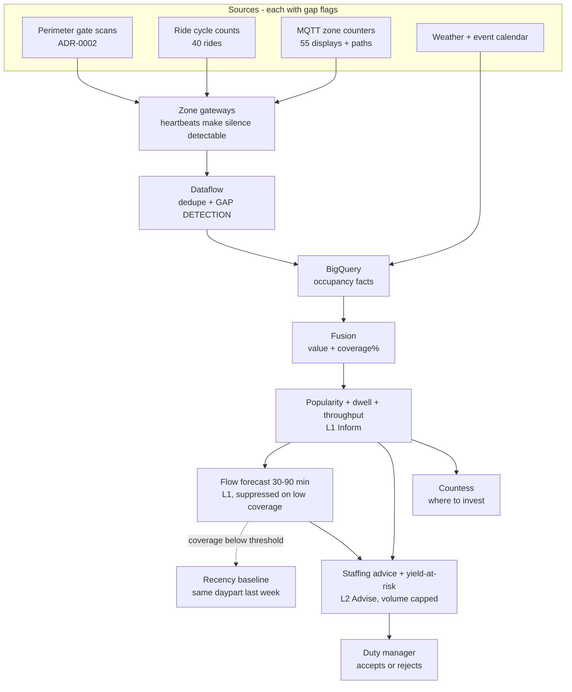
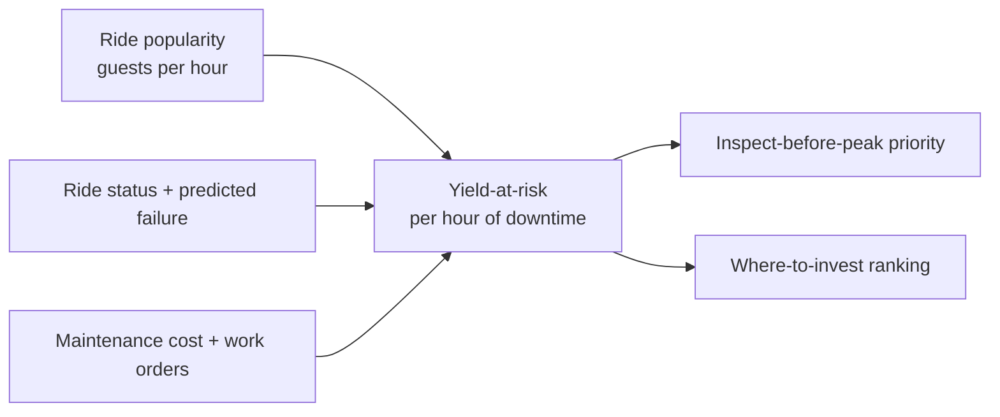

# Deep-dive 2 - Popularity, flow, and staffing

**The business question:** "We have no real idea of what parts of the estates are most popular, so it's difficult to know where to invest & deploy staff."

This is the kata's most-repeated problem, and the answer is mostly infrastructure rather than intelligence. Counting comes first; forecasting is a thin layer on top; and both are required to say when they cannot see.

## The pipeline



## Container view

| Container | Responsibility | ADR |
|:--|:--|:--|
| **Zone gateways** | Collect counters and cycle counts; emit heartbeats so a silent sensor is distinguishable from a quiet zone. | [ADR-0003](../../../adrs/ADR-0003%20-%20MQTT%20gateways%20as%20the%20estate-to-cloud%20path.md) |
| **Dataflow gap detection** | Creates the explicit gap markers everything downstream depends on. This is where `unknown` is born. | [ADR-0003](../../../adrs/ADR-0003%20-%20MQTT%20gateways%20as%20the%20estate-to-cloud%20path.md) |
| **Fusion** | Combines gate scans, cycles, and zone counts into occupancy and dwell, always with a **coverage** figure. Never interpolates across a gap. | [ADR-0013](../../../adrs/ADR-0013%20-%20Popularity%20and%20flow%20as%20advisory%20signals%20that%20degrade%20to%20unknown.md) |
| **Popularity service** | Rank, dwell, throughput versus capacity, by daypart and ticket mix. Investment-grade rankings state their observation window. | [ADR-0013](../../../adrs/ADR-0013%20-%20Popularity%20and%20flow%20as%20advisory%20signals%20that%20degrade%20to%20unknown.md) |
| **Flow forecast capability** | 30-90 minute predicted queue and zone load, with confidence. Suppressed below the coverage threshold. | [ADR-0013](../../../adrs/ADR-0013%20-%20Popularity%20and%20flow%20as%20advisory%20signals%20that%20degrade%20to%20unknown.md) |
| **Recency baseline** | Same daypart last week, same weather class. The named fallback, and the bar the model must beat. | [ADR-0004](../../../adrs/ADR-0004%20-%20Vertex%20AI%20behind%20a%20capability%20interface.md) |
| **Staffing advice capability** | Joins popularity, predicted load, ride downtime, and yield-at-risk into a ranked, capped set of suggestions. | [ADR-0013](../../../adrs/ADR-0013%20-%20Popularity%20and%20flow%20as%20advisory%20signals%20that%20degrade%20to%20unknown.md) |
| **Duty-manager view** | Heat map with data age and unknown states; advice inbox with accept/reject and reason codes. | [4_Maintenance_and_Intranet](../../core-func/4_Maintenance_and_Intranet.md) |

## Flow - a Saturday afternoon

```mermaid
sequenceDiagram
    participant Z as Zone counters
    participant GW as Zone gateway
    participant DF as Dataflow
    participant F as Fusion
    participant FC as Forecast
    participant A as Staffing advice
    actor D as Duty manager
    participant AS as Asset service

    Z->>GW: counts every interval
    GW->>DF: bridged telemetry
    DF->>DF: detect zone C counter silent for 20 min
    DF->>F: zone C = GAP, zones A/B/D = counts
    F->>F: zone C coverage 0%, estate coverage 78%
    F-->>D: heat map: zone C UNKNOWN (not cool)
    F->>FC: occupancy + coverage
    alt coverage above threshold
        FC-->>D: predicted queue by zone, 30-90 min, with confidence
    else coverage below threshold
        FC-->>D: forecast suppressed; recency baseline shown, labelled
    end
    AS->>A: ride 12 status = down, top popularity quartile
    FC->>A: zone D load rising
    A-->>D: "3 hosts to zone D" + "ride 12 down: ~X yield/hour at risk"
    D->>A: accept zone D, reject host reallocation (reason: staff on break)
    Note over A: both decisions are training signal and drift data
```

The important moment is `zone C = GAP`. Everything after it preserves that distinction: the map shows unknown, the forecast knows its coverage dropped, and the advice does not recommend pulling staff out of a zone the estate simply cannot see.

## Why the boring part is the valuable part

Phase 1 has **no model** and already answers the Countess's question:

| Phase | What exists | What it answers |
|:--|:--|:--|
| 1 | Counts, dwell, ranking, heat map with coverage | "Which rides and displays are actually popular?" - the question asked in the brief |
| 2 | Flow forecast in shadow, compared against the recency baseline | "Will the piranha house overflow at 3pm?" |
| 3 | Staffing advice, yield-at-risk, investment ranking | "Where do I send staff, and where do I spend capital?" |

The instrumentation is the deliverable. The forecast is a small time-series model that has to earn its place by beating "same daypart last week" - and if it cannot, keeping the baseline is a legitimate outcome rather than a failure.

## Yield-at-risk: the estate-specific join

Three datasets nobody previously joined:



This turns two separate complaints from [1_1 Business challenges](../../../requirements/1_1_Business%20challenges.md) - "a failed popular ride's lost yield is invisible" and "staff are deployed by habit and anecdote" - into one number that a duty manager and the Countess can both act on, at different timescales.

## Guest-facing use (FR#2G), kept small

The same popularity and flow data drives guest itinerary suggestions - "start at the piranha house, ride 7 has a queue". Deliberately minimal in v1:

- Opt-in only; a visit never requires it.
- Degrades to static "start here" cards at the kiosk when connectivity is poor (NFR_16).
- Never routes through restricted animal areas - that constraint is code, not a prompt instruction.
- A/B tested through [ADR-0011](../../../adrs/ADR-0011%20-%20Sticky%20offline%20experiment%20assignment.md).

No conversational companion, no guest app requirement. The guest-facing surface is a suggestion on a board or a card, because a guest app that needs signal is a guest app that does not work here.

## Verification

Golden cases in [`evals/flow-forecast/`](../../../evals/flow-forecast/).

| What | Metric | Target |
|:--|:--|:--|
| Gap honesty | Zones rendered as zero while gapped | **0** |
| Coverage | Share of 40 rides + 55 displays with daily popularity | ≥90% (OKR 4.1) |
| Forecast quality | Error versus recency baseline on held-out days | Beats baseline (OKR 4.2) |
| Appropriate silence | Forecast suppressed when coverage below threshold | Always |
| Advice usefulness | Duty-manager accept rate | Majority at peak, after shadow (OKR 4.3) |
| Advice volume | Suggestions per shift | Within cap ([ADR-0005](../../../adrs/ADR-0005%20-%20Human-in-the-loop%20authority%20for%20estate%20AI.md)) |

## What this deep-dive does not do

- No camera-based people counting (deferred in [Appendix C](../../../requirements/Appendix%20C_%20Future%20scope.md); NFR_8 prefers counts).
- No individual guest tracking without consent.
- No automatic staff reassignment - the duty manager decides.
- No interpolation across gaps, ever.
- No claim that throughput equals satisfaction. A busy ride and a ride with a broken exit look the same in this data, and that is a stated limitation rather than a hidden one.

Related: [ADR-0013](../../../adrs/ADR-0013%20-%20Popularity%20and%20flow%20as%20advisory%20signals%20that%20degrade%20to%20unknown.md), [ADR-0003](../../../adrs/ADR-0003%20-%20MQTT%20gateways%20as%20the%20estate-to-cloud%20path.md), [maintenance and intranet](../../core-func/4_Maintenance_and_Intranet.md).
