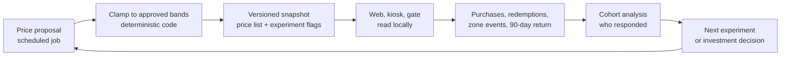
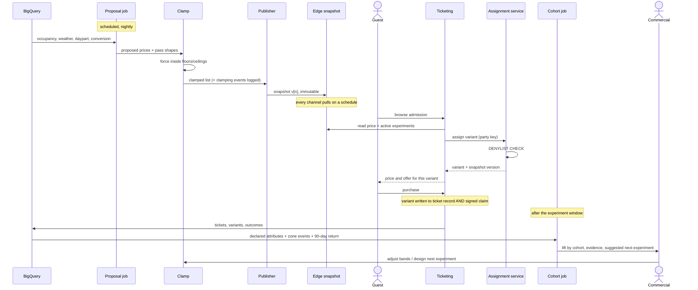

# Deep-dive 1 - Yield: async pricing, offline experiments, cohort analysis

**The business question:** make the estate profitable and earn returning visitors, without putting a model anywhere near the moment a guest pays.

Three capabilities, one loop. Pricing proposes, experiments test, cohort analysis explains who responded and what to try next.

## Why this is one deep-dive and not three

They share a single mechanism - the **published snapshot** - and they are useless apart. A price without an experiment is a guess; an experiment without cohort analysis produces "variant B won by 3%" and no decision; cohort analysis with nothing to analyse is a dashboard.

## Container view

| Container | Responsibility | ADR |
|:--|:--|:--|
| **Price proposal job** | Scheduled. Reads occupancy, daypart, weather, calendar, conversion history from BigQuery. Proposes per-SKU prices and family-pass shapes. | [ADR-0010](../../../adrs/ADR-0010%20-%20Publish%20prices%20asynchronously%20inside%20approved%20bands.md) |
| **Clamp** | Deterministic code, outside the model. Forces every proposal inside commercial floors and ceilings. Logs any clamping as a drift signal. | [ADR-0010](../../../adrs/ADR-0010%20-%20Publish%20prices%20asynchronously%20inside%20approved%20bands.md) |
| **Price and flag publisher** | Writes the versioned, immutable snapshot. The only writer to the guest-facing price list. | [ADR-0010](../../../adrs/ADR-0010%20-%20Publish%20prices%20asynchronously%20inside%20approved%20bands.md) |
| **Assignment service** | At order creation only. Hashes the party key against the active experiment snapshot. Enforces the **denylist in code**. | [ADR-0011](../../../adrs/ADR-0011%20-%20Sticky%20offline%20experiment%20assignment.md) |
| **Edge snapshot store** | Holds the last-known-good price list and flag snapshot on every channel, each with its age. | [ADR-0003](../../../adrs/ADR-0003%20-%20MQTT%20gateways%20as%20the%20estate-to-cloud%20path.md) |
| **Cohort analysis job** | Clusters and compares outcomes on declared and consented attributes. GenAI writes the narrative; SQL produces the numbers. | [ADR-0012](../../../adrs/ADR-0012%20-%20Cohort%20analysis%20on%20declared%20attributes%20only.md) |
| **Commercial console** | Where bands are approved, experiments designed, and lift reviewed. | - |

## Flow - propose, publish, sell, learn

## The two rules that make this safe

**Nothing in this diagram is called by the guest's request except the snapshot read.** The proposal job, the clamp, and the cohort job are all async. If every one of them is down, the estate still sells tickets at its last published prices. That is the [hld/README](../../README.md) boundary, honoured.

**The clamp is code, and the denylist is code.** Neither is a model property or a config toggle. A model that proposes a ruinous price gets clamped; an experiment that names a safety factor fails to register. These are the two places where "the AI did something stupid" is structurally prevented rather than monitored for.

## Phase 1 works with no model at all

[Appendix C](../../../requirements/Appendix%20C_%20Future%20scope.md) phases this deliberately:

| Phase | Pricing | Experiments | Cohorts |
|:--|:--|:--|:--|
| 1 | Commercial sets prices by hand, published through this exact pipeline | A/B on family-pass shapes, sticky and offline | Declared-attribute pivot tables |
| 2 | Model proposes in shadow; humans compare against manual | Composition, bundles, vouchers | Clustering on declared attributes |
| 3 | Model publishes automatically inside bands, holdout retained | Daypart, membership versus voucher | Narrative generation with citations |

The pipeline ships before the intelligence does. By the time a model proposes a price, publish, pull, clamp, holdout, and rollback have all been exercised in production with humans choosing the numbers. This is also how we get the conversion history the model needs, since none exists today.

## Verification

Golden cases in [`evals/pricing/`](../../../evals/pricing/) and [`evals/cohorts/`](../../../evals/cohorts/).

| What | Metric | Target |
|:--|:--|:--|
| Clamp integrity | Floor/ceiling violations in published snapshots | **0** |
| Model value | Yield per visitor, model cohort vs holdout | Positive lift, no guardrail regression |
| Stickiness | One party observed under two variants | 0 |
| Denylist | Safety/welfare/accessibility/legal factor registered | 0, enforced at definition |
| Privacy | Inferred attributes persisted to a guest record | **0, structurally** |
| Offline | Purchases completed from a stale snapshot | Works; staleness observed and bounded |
| Narrative | Groundedness on generated cohort insight | Claims traceable to supplied metrics |

The holdout is what makes the second row meaningful. Without it, a sunny quarter and a good model are indistinguishable.

## What this deep-dive does not do

- No per-guest personalised pricing (a published list is per-SKU and per-segment).
- No surge pricing for guests already inside the estate.
- No pricing on inferred demographics.
- No experiment on safety closures, evacuation copy, welfare thresholds, exit accessibility, or legal terms.
- No mid-visit variant reassignment - a variant cannot be recalled once a guest holds it.

The last one is the sharpest constraint and it is deliberate: stickiness offline costs post-purchase flexibility, so experiment definitions get reviewed before publication rather than steered afterwards.

Related: [ADR-0010](../../../adrs/ADR-0010%20-%20Publish%20prices%20asynchronously%20inside%20approved%20bands.md), [ADR-0011](../../../adrs/ADR-0011%20-%20Sticky%20offline%20experiment%20assignment.md), [ADR-0012](../../../adrs/ADR-0012%20-%20Cohort%20analysis%20on%20declared%20attributes%20only.md), [core platform](../../core-func/README.md).
